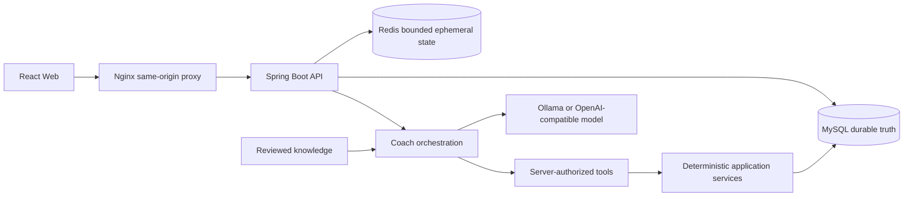

# HBTI Coach 学习与面试指南

本指南服务于两个目标：帮助开发者沿着真实代码学习项目，也让交接模型可以用
可验证的文件入口理解设计。这里描述的是当前 `codex/hbti-platform` 分支的
L1 public beta 实现，不把它描述为医疗产品、企业级系统或 HBTI 科学诊断工具。

## 1. 先建立正确边界

HBTI V1 是不可变、非诊断的探索性偏好模型。连续维度先于四字母类型码；HBTI
只能调整解释方式、关注重点和监测方式，不能决定热量、安全、治疗或高风险运动。
成人资格、安全筛查、BMI/BMR/TDEE、目标范围、计划状态和持久化事实由确定性
Java 代码负责。模型输出是未受信任的指导文字，不能获得授权，也不能直接写入
业务事实。完整边界见 [ADR-015](decisions/ADR-015-adopt-shared-hbti-research-development-agreement.md)。

推荐阅读顺序：

1. [产品规格](specs/hbti-coach-product-spec.md)
2. [当前架构](architecture/hbti-coach-architecture.md)
3. [MySQL 决策 ADR](decisions/ADR-002-use-mysql-as-primary-store.md)
4. [HBTI 共享协议 ADR](decisions/ADR-015-adopt-shared-hbti-research-development-agreement.md)
5. 本指南中的代码入口和练习
6. [AI handoff](AI_HANDOFF.md) 与 [发布清单](RELEASE_CHECKLIST.md)

## 2. 技术栈和真实入口

| 主题 | 当前实现 | 入口 |
|---|---|---|
| 应用启动和定时任务 | Spring Boot 模块化单体、保留清理任务 | [`HbtiCoachApplication`](../src/main/java/com/atguigu/java/ai/langchain4j/HbtiCoachApplication.java)、[`RetentionCleanupJob`](../src/main/java/com/atguigu/java/ai/langchain4j/common/retention/RetentionCleanupJob.java) |
| 身份与安全 | Spring Security、JWT、Cookie、CSRF、刷新令牌轮换 | [`SecurityConfig`](../src/main/java/com/atguigu/java/ai/langchain4j/identity/security/SecurityConfig.java)、[`AuthenticationService`](../src/main/java/com/atguigu/java/ai/langchain4j/identity/AuthenticationService.java) |
| 持久化 | MySQL 8、MyBatis、Flyway；测试使用 H2 | [`pom.xml`](../pom.xml)、[`application.properties`](../src/main/resources/application.properties)、[`migration`](../src/main/resources/db/migration) |
| 缓存与限流 | Redis 只存有界、过期或可重建状态 | [`RedisEphemeralStateStore`](../src/main/java/com/atguigu/java/ai/langchain4j/infrastructure/redis/RedisEphemeralStateStore.java)、[`EphemeralStateConfig`](../src/main/java/com/atguigu/java/ai/langchain4j/config/EphemeralStateConfig.java) |
| AI 集成 | LangChain4j 同步/流式 provider，离线模式可运行 | [`ChatModelConfig`](../src/main/java/com/atguigu/java/ai/langchain4j/config/ChatModelConfig.java)、[`ScenePromptRepository`](../src/main/java/com/atguigu/java/ai/langchain4j/coach/prompt/ScenePromptRepository.java) |
| Web | React、TypeScript、Vite、同源 Nginx 代理 | [`web/src`](../web/src)、[`web/nginx.conf`](../web/nginx.conf)、[`web/Dockerfile`](../web/Dockerfile) |
| 交付 | 非 root 镜像、离线 Compose、CI 和发布证据 | [`docker-compose.yml`](../docker-compose.yml)、[`ci.yml`](../.github/workflows/ci.yml)、[`release-evidence.yml`](../.github/workflows/release-evidence.yml) |

## 3. 运行时数据流



个人数据查询必须从已验证 JWT subject 推导所有权。Redis 丢失不能丢失用户事实；
模型不可用时，确定性资料、评估、计划、跟踪和周回顾仍可用，教练功能返回明确
的可重试错误。

## 4. 按模块学习

### 4.1 Identity：认证、会话和删除

从 [`AuthenticationService`](../src/main/java/com/atguigu/java/ai/langchain4j/identity/AuthenticationService.java)
开始，跟踪注册、登录和会话创建；再读
[`RefreshTokenService`](../src/main/java/com/atguigu/java/ai/langchain4j/identity/RefreshTokenService.java)
理解刷新令牌哈希、家族轮换和重放检测；最后读
[`AccountDeletionService`](../src/main/java/com/atguigu/java/ai/langchain4j/identity/AccountDeletionService.java)
和 [`AccountDataExportService`](../src/main/java/com/atguigu/java/ai/langchain4j/identity/AccountDataExportService.java)。

要点：访问令牌是短期签名凭证，刷新令牌只保存摘要；Cookie 写入需要 CSRF；
删除必须按确认词执行，并区分可删除用户事实与保留的匿名审计/全局定义。

### 4.2 Profile：所有权和安全筛查

阅读 [`ProfileService`](../src/main/java/com/atguigu/java/ai/langchain4j/profile/ProfileService.java)
和 [`SafetyScreeningPolicy`](../src/main/java/com/atguigu/java/ai/langchain4j/profile/SafetyScreeningPolicy.java)。
筛查记录是带版本的不可变事实；不满足成人或安全条件时，计划服务拒绝自动规划，
而不是让模型自行解释或绕过规则。

### 4.3 Assessment：版本化 HBTI 和连续维度

阅读 [`HbtiScoringEngine`](../src/main/java/com/atguigu/java/ai/langchain4j/assessment/HbtiScoringEngine.java)、
[`HbtiAssessmentService`](../src/main/java/com/atguigu/java/ai/langchain4j/assessment/HbtiAssessmentService.java)
和 [`HbtiAssessmentController`](../src/main/java/com/atguigu/java/ai/langchain4j/assessment/api/HbtiAssessmentController.java)。
定义来自 [`V4 migration`](../src/main/resources/db/migration/V4__publish_hbti_definition_v1.sql)，
提交答案和评分结果使用用户范围的幂等键。四字母码只是兼容性展示，前端先呈现
连续维度。原型黄金样例只证明 JavaScript/Java 软件一致性，不证明心理测量效度。

### 4.4 Planning：确定性计算和计划状态机

阅读 [`HealthCalculator`](../src/main/java/com/atguigu/java/ai/langchain4j/planning/HealthCalculator.java)、
[`TargetRangePolicy`](../src/main/java/com/atguigu/java/ai/langchain4j/planning/TargetRangePolicy.java)
和 [`WeightPlanService`](../src/main/java/com/atguigu/java/ai/langchain4j/planning/WeightPlanService.java)。
计算使用显式单位、版本和舍入规则；保守目标范围不低于计算的 BMR。计划按
`DRAFT -> VALIDATED -> CONFIRMED -> ACTIVE` 变化，替换活动计划在同一账户锁和
事务中完成，模型只能提出草稿讨论。

### 4.5 Tracking：事实、幂等和七日回顾

阅读 [`DailyTrackingService`](../src/main/java/com/atguigu/java/ai/langchain4j/tracking/DailyTrackingService.java)、
[`WeeklyReviewPolicy`](../src/main/java/com/atguigu/java/ai/langchain4j/tracking/WeeklyReviewPolicy.java)
和 [`WeeklyReviewService`](../src/main/java/com/atguigu/java/ai/langchain4j/tracking/WeeklyReviewService.java)。
体重、营养、训练、睡眠是带单位的每日事实；本地日期边界和重复写入由服务端校验。
周回顾读取固定七日窗口，数据不足时不提出调整；即使有提案，也不会自动修改
或激活计划。

### 4.6 Coach：模型边界、工具授权和流式弹性

同步入口是 [`CoachChatService`](../src/main/java/com/atguigu/java/ai/langchain4j/coach/service/CoachChatService.java)，
流式入口是 [`CoachStreamingService`](../src/main/java/com/atguigu/java/ai/langchain4j/coach/streaming/CoachStreamingService.java)。
工具由 [`CoachToolProvider`](../src/main/java/com/atguigu/java/ai/langchain4j/coach/streaming/CoachToolProvider.java)
和 [`CoachTools`](../src/main/java/com/atguigu/java/ai/langchain4j/coach/tool/CoachTools.java)
提供，所有者从 [`CoachToolContext`](../src/main/java/com/atguigu/java/ai/langchain4j/coach/tool/CoachToolContext.java)
绑定，工具不接受模型提供的 owner 参数。提示模板位于
[`src/main/resources/prompts/hbti`](../src/main/resources/prompts/hbti)。

流式服务使用首 token/总时长超时、最多五个并发、熔断、取消清理和命名 JSON SSE
事件；模型故障不会改变确定性领域服务的可用性。模型最大输出和本地 Ollama
上下文上限见 [`ModelGenerationLimits`](../src/main/java/com/atguigu/java/ai/langchain4j/config/ModelGenerationLimits.java)。

### 4.7 Knowledge：审核知识和有界检索

阅读 [`KnowledgeIngestionService`](../src/main/java/com/atguigu/java/ai/langchain4j/knowledge/KnowledgeIngestionService.java)
和 [`ReviewedKnowledgeRetriever`](../src/main/java/com/atguigu/java/ai/langchain4j/knowledge/ReviewedKnowledgeRetriever.java)。
只有已审核、已发布且 locale 匹配的版本参与检索；候选、阈值、返回段落和引用元数据
都有上限。它是可审计的词法检索，不是向量搜索，也没有互联网规模吞吐声明。

### 4.8 Common/Infrastructure：观察、保留和 Redis

阅读 [`RequestCorrelationFilter`](../src/main/java/com/atguigu/java/ai/langchain4j/common/observability/RequestCorrelationFilter.java)、
[`AuditEventService`](../src/main/java/com/atguigu/java/ai/langchain4j/common/audit/AuditEventService.java)、
[`RetentionCleanupService`](../src/main/java/com/atguigu/java/ai/langchain4j/common/retention/RetentionCleanupService.java)
和 [`DatabaseHealthIndicator`](../src/main/java/com/atguigu/java/ai/langchain4j/config/DatabaseHealthIndicator.java)。
日志、审计和指标只保留低基数、脱敏字段；readiness 与 liveness 语义不同；清理任务
七天后删除过期刷新令牌哈希，180 天后删除审计事件。

## 5. Flyway 数据演进

当前 schema 为 **V12**，迁移只追加、不重写：

| 版本 | 事实 |
|---|---|
| V1 | 会话和消息表 |
| V2 | 账户、刷新令牌和身份约束 |
| V3 | 用户资料和安全筛查 |
| V4 | 发布 HBTI V1 定义 |
| V5 | 评估尝试、答案和评分结果 |
| V6 | 版本化体重计划 |
| V7 | 每日指标、营养和训练事实 |
| V8 | 不可变七日周回顾 |
| V9 | 审核知识源、版本和分块 |
| V10 | 审计事件 |
| V11 | 审计请求关联和失败事件上下文（Java migration） |
| V12 | 会话归属与账户删除级联 |

SQL migration 在 [`src/main/resources/db/migration`](../src/main/resources/db/migration)，
可重试的 V11 Java migration 在
[`V11__extend_audit_event_context`](../src/main/java/db/migration/V11__extend_audit_event_context.java)。
生产启动会校验 Flyway 历史，不自动 repair；破坏性变更需要备份和
expand-migrate-contract 策略。

## 6. 必须掌握的实现模式

### 所有权边界

Controller 从 Spring Security 上下文取得 owner，Service 将 owner 传给 MyBatis，
查询包含所有权谓词。模型只看到服务器注册的工具，不会看到数据库凭证或任意用户 ID。

### 幂等写入

规范化参数生成 SHA-256 摘要；同一 owner、同一 key 且 payload 相同则重放原结果，
payload 不同则报冲突。业务事实和幂等结果在 MySQL 事务中提交，Redis 不保存可恢复事实。

### 确定性与 AI 分层

将“能算、能授权、能审计”的部分放入 Java；将“解释、提问、措辞”的部分交给模型。
模型故障、提示注入或无证据检索都必须失败得诚实，而不是生成看似确定的医疗建议。

### 受控流式输出

每次请求有首 token/总时长预算、并发许可、熔断状态和终态竞争；客户端取消必须释放
许可并清理工具上下文，迟到的 provider 片段不能重新授权。

## 7. 可执行学习实验

默认测试不连接外部 MySQL、Redis、Docker 或模型：

```powershell
mvn -q clean test
npm --prefix web ci
npm --prefix web test
npm --prefix web run build
```

推荐实验顺序：

1. 修改一个 H2 测试中的 owner，观察所有权测试如何阻止跨用户读取。
2. 重放一个相同幂等键，比较相同 payload 与冲突 payload 的结果。
3. 让 mock model 超时，确认 readiness、计算和跟踪功能仍遵守各自边界。
4. 阅读 [`scripts/evaluation/run-ai-safety-evaluation.ps1`](../scripts/evaluation/run-ai-safety-evaluation.ps1)、
   [`scripts/load/run-l1-load.ps1`](../scripts/load/run-l1-load.ps1)、
   [`scripts/recovery/test-mysql-restore.ps1`](../scripts/recovery/test-mysql-restore.ps1)
   和 [`scripts/release/test-rollback.ps1`](../scripts/release/test-rollback.ps1)，理解
   真实 Compose 证据如何与单元测试分层。
5. 使用 [`scripts/docs/check-markdown-links.ps1`](../scripts/docs/check-markdown-links.ps1)
   检查交接文档的本地链接。

发布证据的边界与数字见 [`docs/RELEASE_CHECKLIST.md`](RELEASE_CHECKLIST.md) 和
[`docs/operations`](operations)。通过这些脚本只证明单实例 L1 public beta 演练，
不能替代平台 TLS、托管密钥、异地加密备份、告警和 30 天 SLO 证明。

## 8. 面试问题与回答线索

| 问题 | 回答必须落到的实现 |
|---|---|
| 为什么从 MongoDB 换成 MySQL？ | 账户、计划、跟踪和审计存在事务/外键/所有权关系；见 [ADR-002](decisions/ADR-002-use-mysql-as-primary-store.md)。 |
| 如何避免模型越权读写？ | JWT subject -> `CoachToolContext` -> 应用服务；工具没有 owner 入参。 |
| HBTI 是否是医学诊断？ | 不是；V1 不可变、连续维度优先、类型码辅助，遵守 ADR-015。 |
| 为什么计划不能由模型直接生成并激活？ | 安全筛查、计算、目标范围和状态机是确定性服务；模型最多提出草稿/解释。 |
| 幂等键为什么只存哈希？ | 降低 email、答案和请求内容泄露风险；payload 变化必须冲突。 |
| Redis 丢失会怎样？ | 丢失计数器/租约/公开定义缓存；MySQL 事实仍在，按不同策略拒绝或回源。 |
| 如何处理刷新令牌重放？ | 保存 token hash 和 family，轮换时锁定/撤销家族并拒绝重放。 |
| 如何做到 Cookie 安全？ | HTTP-only、Secure、SameSite、CSRF double-submit、显式 CORS。 |
| 为什么周回顾不看单日波动？ | 固定七日窗口、最少观测门槛和版本化输入哈希；调整只是提案。 |
| RAG 为什么不用向量库？ | L1 语料有界，审核/发布/引用可审计；当前实现是词法检索，不声称向量规模。 |
| 流式接口如何结束？ | named JSON SSE 事件、首 token/总超时、取消清理、并发许可和熔断终态。 |
| 生产中 MySQL 和 Redis 各自是什么角色？ | MySQL 是 durable truth；Redis 只保存有 TTL 或可重建状态。 |
| 如何证明不是“只会写代码”？ | 展示 ADR、Flyway、测试、Compose smoke、k6、restore、rollback 和 release manifest。 |
| 项目当前是不是企业级？ | 不是；当前是 L1 public beta，公开部署仍需 platform attestation 和 30 天 SLO。 |
| 如何定位模型故障？ | 看 correlation ID、低基数指标、breaker 状态和 runbook；不记录 prompt/输出。 |
| 账户删除如何处理审计？ | 用户事实硬删除，保留审计行匿名化；全局 HBTI/审核知识不随用户删除。 |
| 为什么 H2 测试不等于 MySQL 生产证明？ | H2 验证迁移和 SQL 合同；真实 MySQL 的负载/恢复证据由 Task 23 脚本提供。 |
| 如何升级 HBTI 构念？ | 不修改 V1；提交带证据、局限、兼容和迁移策略的研究提案并新增版本。 |

## 9. 交接完成标准

交给下一模型时优先读取 [AI_HANDOFF.md](AI_HANDOFF.md)、[任务计划](../tasks/plan.md)、
当前执行账本 `.codex/plan-runs/hbti-platform/state.md`、
[架构](architecture/hbti-coach-architecture.md) 和
[ADR-015](decisions/ADR-015-adopt-shared-hbti-research-development-agreement.md)。
检查 `git rev-parse HEAD` 与发布证据的 `gitCommit` 一致，再执行
[`scripts/release/verify-release.ps1`](../scripts/release/verify-release.ps1)。

当前完成标记必须同时满足：代码、迁移、测试、架构、学习材料、发布证据和账本一致；
`tmp/` 是用户自有目录，永远不要修改、删除或提交。
