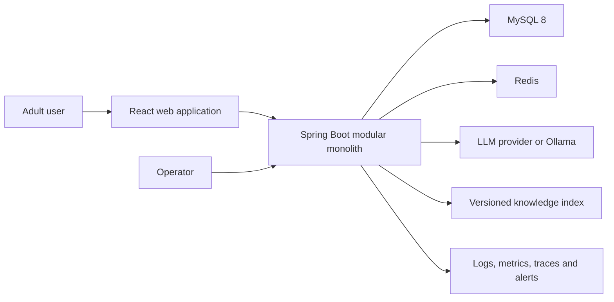
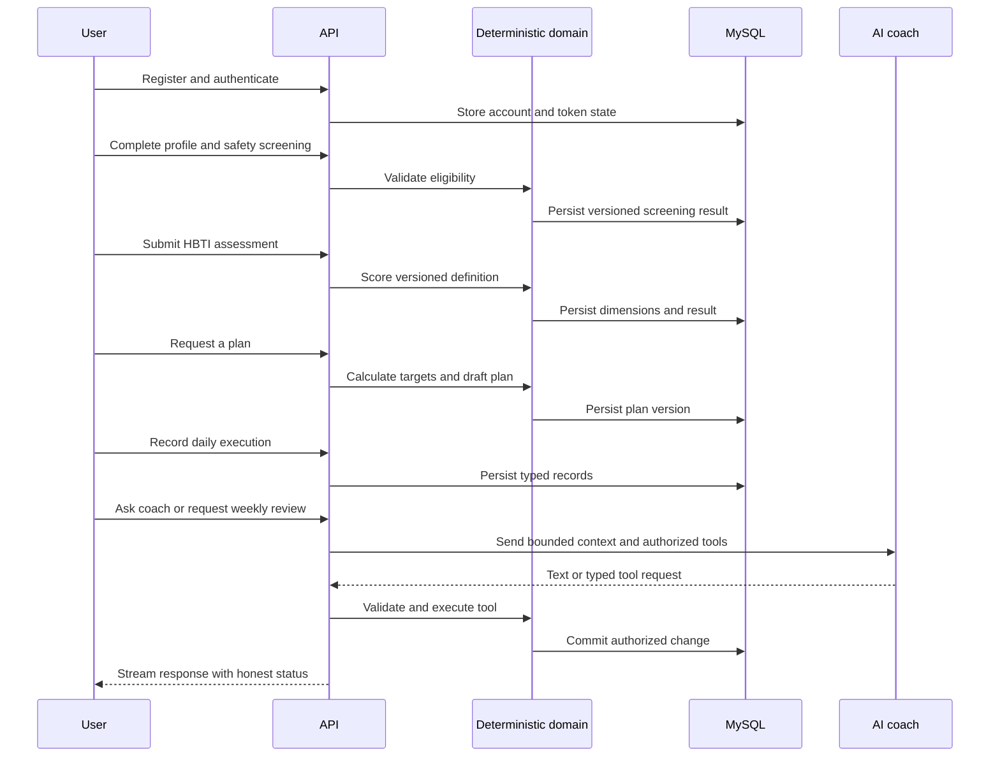

# HBTI Coach Target Architecture

## Document Status

- Status: current implementation baseline
- Approved: 2026-08-14
- Target: L1 public beta
- Product specification: `docs/specs/hbti-coach-product-spec.md`
- Historical course evolution: `docs/architecture/xiaozhi-to-hbti-coach-architecture.md`

This document supersedes the historical medical-to-HBTI execution route. Historical decisions remain available for context, but new implementation must follow this architecture and accepted ADRs.

## Implementation Evidence

The target architecture is delivered incrementally. A capability is considered implemented only when code, migrations, automated tests, and the execution ledger agree.

| Capability | Current evidence | Status |
|---|---|---|
| Architecture baseline | product spec, current architecture, MySQL ADR and 24-task plan | implemented |
| Durable persistence | Flyway V1/V2, MySQL runtime configuration and H2 migration tests | implemented |
| Ordered coach memory | transactional per-conversation replacement and rollback tests | implemented |
| Identity credentials | normalized unique email, BCrypt cost 12, bounded input and hashed-password persistence tests | implemented |
| Authentication sessions | signed access JWT, opaque refresh rotation/reuse detection, CSRF, Cookie/Bearer authentication and logout tests | implemented |
| Profile and safety gate | owned minimal profile, immutable screening versions, adult eligibility and automatic-planning block tests | implemented |
| HBTI definition and scoring | Flyway V4 published bilingual definition, source provenance, read-only catalog and JavaScript parity fixtures | implemented |
| HBTI result history | owned transactional attempts/answers/scores, hashed idempotency keys, current/history API and isolation tests | implemented |
| Deterministic calculations | versioned BMI/BMR/TDEE formulas, conservative target ranges and stale-screening fail-closed policy | implemented |
| Versioned plan lifecycle | owned immutable target snapshots, guarded state transitions, hashed idempotency and transactional active-version replacement | implemented |
| Daily tracking | Flyway V7 typed metric/nutrition/training facts, profile-time-zone date policy, hashed idempotency, owned APIs and deterministic daily aggregation | implemented |
| Weekly review | Flyway V8 immutable review versions, deterministic trend/adherence policy, missing-data gates, bounded proposals and owned APIs | implemented |

Operational SLOs below remain release targets until Task 23 records load, recovery, and rollback evidence. Passing unit tests does not by itself make the service production or enterprise grade.

## Architecture Drivers

1. User health-adjacent data requires explicit ownership, minimization, deletion, and auditability.
2. HBTI is exploratory and influences delivery strategy only; deterministic rules own scoring, energy targets, and safety limits.
3. The public beta needs a complete feedback loop before broad feature expansion.
4. Operational simplicity is more valuable than premature service decomposition.
5. Every model-dependent behavior needs a deterministic fallback or an honest failure state.

## System Context



MySQL is the durable system of record. Redis contains only reconstructable or expiring state. The model and knowledge index are untrusted external boundaries.

## Runtime Shape

The backend is a modular monolith with one deployable process. Modules communicate through Java interfaces and typed application commands, not internal HTTP calls.

```text
identity -> profile -> assessment -> planning -> tracking
                                      |            |
                                      +---- coach -+
knowledge -------------------------------^
common infrastructure supports modules without owning domain rules
```

| Module | Responsibility | Owns durable data |
|---|---|---|
| Identity | accounts, password credentials, access/refresh tokens, ownership context | yes |
| Profile | adult profile, goals, preferences, safety screening | yes |
| Assessment | HBTI definitions, responses, deterministic scoring, result versions | yes |
| Planning | BMI/BMR/TDEE, nutrition targets, plan drafts and activated versions | yes |
| Tracking | weight, nutrition, activity, training, sleep and weekly review facts | yes |
| Coach | conversations, ordered messages, scene orchestration and authorized tools | yes |
| Knowledge | document versions, chunks, citations and evaluation corpus | metadata yes |
| Common | errors, clocks, IDs, security primitives and observability adapters | no domain data |

## Dependency Rules

- Controllers translate HTTP contracts to application commands.
- Application services enforce use-case authorization and transactions.
- Domain logic is deterministic and framework-light.
- MyBatis mappers and model clients are outbound adapters.
- Cross-module reads use narrow query interfaces; direct access to another module's mapper is prohibited.
- Prompt text never grants permissions and never replaces validation.

## Core User Flow



## Data Architecture

### Primary Tables

| Aggregate | Key tables | Important constraints |
|---|---|---|
| Identity | `user_account`, `refresh_token` | unique normalized email; hashed secrets; token rotation |
| Profile | `user_profile`, `safety_screening` | one current profile per user; immutable screening versions |
| Assessment | `assessment_definition`, `assessment_item`, `assessment_attempt`, `assessment_answer`, `assessment_score` | definition version immutable after publication |
| Planning | `weight_plan`, `weight_plan_version` | one aggregate per user; one authoritative active-version pointer; immutable target payload per version |
| Tracking | `daily_metric`, `training_log`, `nutrition_log`, `weekly_review` | user/date/type uniqueness where applicable |
| Coach | `coach_conversation`, `coach_message` | ownership FK; `(conversation_id, sequence_no)` unique |
| Knowledge | `knowledge_document`, `knowledge_chunk` | source and content version traceable |
| Governance | `audit_event`, `prompt_version`, `model_policy` | append-only security-relevant history |

All user-owned tables include an ownership path that can be constrained in the query. Public identifiers are non-sequential UUIDs; internal numeric keys may be used only where they are never exposed.

The identity schema is introduced by Flyway V2. `user_account` stores only normalized email and an adaptive password hash. `refresh_token` stores SHA-256 token digests, family ownership, replacement links, expiry, and revocation timestamps; raw refresh tokens exist only at the delivery boundary and are never durable data.

Flyway V3 introduces the profile and screening boundary. `user_profile` stores only calculation inputs needed by deterministic planning: birth date, calculation sex, height, current and target weight, activity level, and IANA time zone. It intentionally excludes names, free-text medical history, diagnoses, and other unneeded health data. Each `safety_screening` row is an immutable, user-owned version; the profile row is locked while its monotonic version advances so concurrent submissions cannot silently overwrite history. The five self-reported risk flags route planning to `ELIGIBLE`, `PROFESSIONAL_REVIEW`, or `INELIGIBLE`; they do not make a diagnosis.

### Chat Memory

The durable message table stores one message per row. The LangChain4j memory adapter returns a bounded ordered window. Updating memory is transactional. Concurrent writes must either serialize per conversation or detect a version conflict; silent last-write-wins behavior is not acceptable for public beta.

### Migrations

Flyway migrations are append-only after merge. Production startup validates migrations and does not auto-repair history. Destructive changes require expand-migrate-contract steps, backups, and rollback instructions.

## Authentication And Authorization

- Passwords use an adaptive password hash supported by Spring Security.
- Access JWTs are short lived; refresh tokens rotate and are stored as hashes.
- Browser delivery uses secure, HTTP-only, same-site cookies in same-origin deployment. API bearer support must follow the same token policy.
- Cookie-authenticated state changes retain CSRF protection; `/api/v1/auth/csrf` bootstraps the double-submit token for the web client.
- Access tokens are HS256 signed for the single issuing modular monolith, contain only subject and lifecycle claims, and require the configured issuer plus `tokenType=access`.
- Refresh tokens are 256-bit opaque values. Rotation locks the digest row; reuse revokes the entire family before returning a generic session error.
- L1 login throttling is a bounded per-process IP-and-email guard. Task 16 moves shared enforcement to Redis before multi-instance deployment; the local guard is defense in depth, not a distributed quota.
- Every protected application command receives an authenticated user ID.
- Mapper queries include ownership predicates; fetching by resource ID and checking later is insufficient.
- Profile and screening requests never accept a user ID. Their owner is always the validated JWT subject, and screening reads include that owner in SQL.
- Authentication events, token reuse, data export, deletion, and plan activation create audit events without sensitive payloads.

## Deterministic And AI Boundaries

### Code Must Own

- Adult eligibility and safety routing.
- HBTI scoring and version mapping.
- BMI, BMR, TDEE, calorie and macro ranges.
- Plan constraints, activation, daily aggregation and trend statistics.
- Authorization, validation, persistence success, rate and cost limits.

Health calculation version `MIFFLIN_ST_JEOR_METRIC_V1` uses metric profile inputs, explicit `HALF_UP` rounding, and declared activity factors. Target policy `CONSERVATIVE_ENERGY_RANGE_V1` returns ranges rather than a falsely precise prescription and never lets a loss-range lower bound fall below calculated BMR. These values are planning estimates, not diagnoses or guaranteed expenditure. Automatic target generation fails closed unless the persisted screening is eligible, matches the profile screening version, and is not older than the last profile update. ADR-005 records assumptions and version-change rules.

### AI May Own

- Explanation, reflective questions, supportive wording and summarization.
- Selection among explicitly allowed read tools.
- Proposed plan wording or adjustments that remain drafts until validated and confirmed.

Model output is untrusted. Tools use typed schemas, server-derived user IDs, bounded arguments, and application-service authorization. A prompt-injected user message cannot alter those controls.

## HBTI Governance

- Assessment definitions and scoring keys are versioned and immutable after publication.
- Results expose continuous dimension scores before any four-letter shorthand.
- UI, API and generated content display the non-diagnostic limitation near interpretation.
- Golden fixtures imported from the prototype prove Java scoring parity.
- Changes to wording, scoring, normalization, or interpretation require a new version and evaluation report.

Definition `1.0.0` and scoring rule `1.0.0` are frozen by Flyway V4 from `hbti-prototype` commit `bdd1e9f...`. Sixteen ordered 1-5 items cover `FS`, `HC`, `RW`, and `ND`. Scores use the prototype's normalized directional mean, integer percentage rounding, and left-pole tie rule. The public domain contract accepts an answer list so duplicate item IDs remain detectable. Missing, unknown, duplicate, and out-of-range answers fail before scoring. Optional biomarker values do not modify HBTI results. ADR-004 records the full compatibility decision.

Flyway V5 stores completed user-owned attempts, immutable answer facts, and ordered dimension scores. Submission locks the authenticated account row, checks the user-scoped SHA-256 idempotency digest, validates and scores through the published definition, then commits all rows in one transaction. A replay with the same canonical payload returns the original result; key reuse with different content is a conflict. Current and paginated history queries include `user_id` in SQL, and API requests contain no trusted owner or score fields.

Flyway V6 stores one `weight_plan` aggregate per user and append-only target payloads in `weight_plan_version`. A version snapshots the profile update timestamp, screening identity/version, HBTI attempt, formula and policy versions, BMI/BMR/TDEE, energy range and weekly-change guardrail. Lifecycle metadata moves through `DRAFT -> VALIDATED -> CONFIRMED -> ACTIVE -> REPLACED`; payload fields never change. `weight_plan.active_version_id` is the authoritative current pointer, and the owner-scoped activation transaction only assigns a version loaded from that aggregate. Its foreign key uses `ON DELETE SET NULL` so later user-data deletion does not form a restrictive cycle. Creation and activation lock the authenticated account row, store only SHA-256 idempotency-key digests, and replace the prior ACTIVE version in the same transaction. Every transition rechecks current profile, screening, assessment, formula and target-policy provenance and fails closed when they changed. ADR-006 records this lifecycle decision.

Flyway V7 adds daily execution facts. `daily_metric` stores optional kilograms, steps, activity minutes, sleep minutes, and sleep quality with at least one value required; `nutrition_log` stores one kcal-and-macronutrient summary per local date; `training_log` permits multiple bounded, typed sessions. Dates are interpreted using the owner's persisted IANA time zone and are limited to today through 90 days ago. Metric and nutrition uniqueness is per owner and local date, while training uniqueness is per owner and hashed idempotency key. Account-row locking makes retry decisions and date uniqueness deterministic across instances. Daily summaries are owner-scoped and calculated in Java without a model. ADR-007 records these fact and retry semantics.

Flyway V8 adds immutable `weekly_review` versions. Policy `DETERMINISTIC_WEEKLY_REVIEW_V1` reads exactly seven local dates, calculates an ordered least-squares weekly weight trend, reports observation coverage separately from adherence, and keeps missing averages nullable. Fewer than three weight days or four nutrition days cannot produce an energy adjustment. With sufficient data and at least 75% logged-energy adherence, a trend outside the active plan guardrail can propose at most `+100` or `-100 kcal/day`; the proposal never mutates or activates a plan. The generation transaction takes the same owner account lock used by plan and tracking writes, snapshots the active plan and ordered facts, and hashes those inputs. Identical inputs replay the existing review; late facts or a changed active plan create a new version without rewriting history. ADR-008 records these rules.

## Knowledge And RAG

Only reviewed sources enter the published index. Ingestion records source URL, publisher, retrieval date, content hash, reviewer, locale, and lifecycle status. Retrieval is user-data isolated and returns citations. Missing evidence results in a qualified response, not fabricated authority.

RAG release gates include retrieval recall, citation correctness, groundedness, prompt-injection resistance, and stale-document behavior on a versioned evaluation set.

## API And Error Contract

- REST resources live under `/api/v1` and use camelCase JSON.
- Validation errors, authentication errors, domain conflicts and service failures use the shared `{ error: { code, message, details } }` envelope.
- List endpoints are paginated with deterministic ordering.
- Idempotency keys protect retryable create/activate operations.
- SSE streams use named events for metadata, token deltas, completion and errors; a stream never reports success before tool transactions commit.
- OpenAPI is generated and checked as part of the build.

## Reliability And Degradation

| Dependency | Timeout | Retry | Degradation |
|---|---:|---|---|
| MySQL | 2 s operation budget | idempotent reads only | reject writes honestly; health becomes unready |
| Redis | 200 ms | one bounded retry | fall back to conservative local limits or reject sensitive operations |
| Model | 30 s total, 5 s first token target | only before output and when safe | deterministic features remain available; coach returns typed unavailable error |
| Knowledge index | 2 s | one read retry | answer without RAG only for safe general content and disclose limitation |

Circuit breakers prevent cascading model and retrieval failures. Retry budgets and concurrency limits are global, not multiplied at every layer.

## Observability

Structured logs include request ID, user pseudonymous ID, route, result code, latency, model policy version, prompt version, tool name, and token counts. They exclude message bodies, credentials, health measurements, and assessment answers.

Metrics cover HTTP latency/errors, database pool, authentication failures, model latency/tokens/cost, tool outcomes, SSE first-token time, queue depth, safety routing, and evaluation version. Traces connect HTTP, SQL, retrieval and model spans without sensitive content.

## SLO And Capacity

### L1 Assumptions

- Up to 1,000 registered users, 100 daily active users.
- 20 concurrent interactive sessions and 5 concurrent model generations.
- 100 API requests per second short burst; 20 sustained requests per second excluding model tokens.
- Maximum 4,000 characters per user message, 8,000 input tokens, 1,500 output tokens, and 10 tool calls per request.

### L1 Internal SLO

| Signal | Target |
|---|---:|
| Monthly API availability excluding announced maintenance | 99.5% |
| Non-model API p95 latency | <= 500 ms |
| Non-model API p99 latency | <= 1,500 ms |
| SSE first token p95 | <= 3 s |
| Server error rate | < 1% over 15 minutes |
| Successful authenticated writes | >= 99.5% |

Promotion to L2 requires 30 days of measured compliance, load-test evidence, on-call ownership, tested backup restoration, security review, and a rollback exercise. Architecture labels alone never qualify the service as enterprise or production grade.

## Data Lifecycle

- Users can export and delete their data through authenticated workflows.
- Account deletion revokes tokens immediately and queues bounded deletion of owned data with an auditable completion result.
- Conversation and tracking retention are explicit product settings; backups expire according to the documented schedule.
- L1 target: MySQL RPO 1 hour and RTO 4 hours, verified by restoration exercise.
- Prompt, model, assessment and knowledge versions remain traceable after user-content deletion without retaining deleted user content.

## Deployment

The reference environment uses containers for the backend, web application, MySQL, Redis and local observability dependencies. Production uses managed equivalents where available. Health endpoints separate liveness from readiness. Schema migration is a controlled release step. Secrets enter through the deployment platform and never image layers or source files.

Deployments are rolling or blue/green once more than one instance exists. Every release records artifact version, migration range, prompt/model policy, evaluation report and rollback command.

Authentication requires `AUTH_SIGNING_KEY` with at least 32 UTF-8 bytes. Production keeps `AUTH_SECURE_COOKIES=true`; the false setting exists only for local HTTP and isolated tests. Signing-key rotation requires an explicit multi-key validation design before L1 launch and is tracked in the authentication ADR.

## Delivery Order

1. Consolidate architecture and replace MongoDB with MySQL chat storage.
2. Add identity, ownership, profile and safety screening.
3. Import and version HBTI assessment with golden scoring tests.
4. Add deterministic calculations, plans, daily records and weekly reviews.
5. Bind authorized tools, RAG and streaming to the domain services.
6. Add Redis controls, observability, frontend flows, CI, containers and release gates.

The detailed executable checklist lives in `tasks/plan.md` and `tasks/todo.md`.
