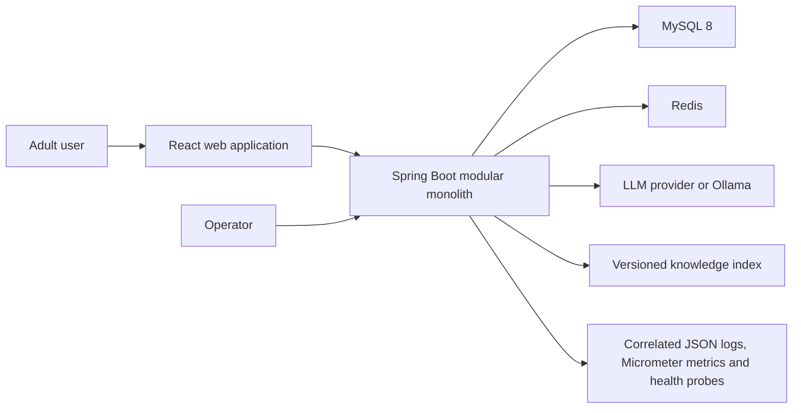
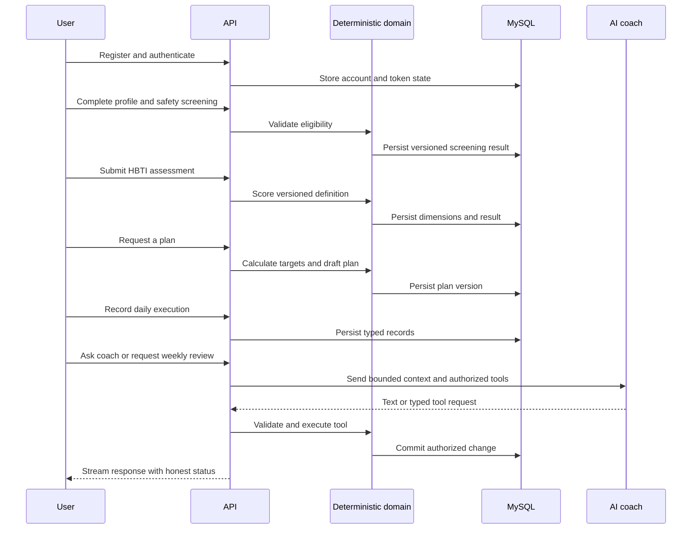

# HBTI Coach Target Architecture

## Document Status

- Status: current implementation baseline
- Approved: 2026-08-14
- Target: L1 public beta
- Product specification: `docs/specs/hbti-coach-product-spec.md`
- Historical course evolution: `docs/architecture/xiaozhi-to-hbti-coach-architecture.md`

This document supersedes the historical medical-to-HBTI execution route. Historical decisions remain available for context, but new implementation must follow this architecture and accepted ADRs.

## Implementation Evidence

The target architecture is delivered incrementally. A capability is considered implemented only when code, migrations, automated tests, and the execution ledger agree.

| Capability | Current evidence | Status |
|---|---|---|
| Architecture baseline | product spec, current architecture, MySQL ADR and 24-task plan | implemented |
| Durable persistence | Flyway V1/V2, MySQL runtime configuration and H2 migration tests | implemented |
| Ordered coach memory | transactional per-conversation replacement and rollback tests | implemented |
| Identity credentials | normalized unique email, BCrypt cost 12, bounded input and hashed-password persistence tests | implemented |
| Authentication sessions | signed access JWT, opaque refresh rotation/reuse detection, CSRF, Cookie/Bearer authentication and logout tests | implemented |
| Profile and safety gate | owned minimal profile, immutable screening versions, adult eligibility and automatic-planning block tests | implemented |
| HBTI definition and scoring | Flyway V4 published bilingual definition, source provenance, read-only catalog and JavaScript parity fixtures | implemented |
| HBTI result history | owned transactional attempts/answers/scores, hashed idempotency keys, current/history API and isolation tests | implemented |
| Deterministic calculations | versioned BMI/BMR/TDEE formulas, conservative target ranges and stale-screening fail-closed policy | implemented |
| Versioned plan lifecycle | owned immutable target snapshots, guarded state transitions, hashed idempotency and transactional active-version replacement | implemented |
| Daily tracking | Flyway V7 typed metric/nutrition/training facts, profile-time-zone date policy, hashed idempotency, owned APIs and deterministic daily aggregation | implemented |
| Weekly review | Flyway V8 immutable review versions, deterministic trend/adherence policy, missing-data gates, bounded proposals and owned APIs | implemented |
| Authorized coach tools | six typed LangChain4j tools, JWT-bound invocation context, server-derived write idempotency, owner-scoped services and fail-closed tests | implemented |
| Reviewed knowledge retrieval | Flyway V9 source/version/chunk lifecycle, publication filtering, deterministic bounded retrieval, citation metadata and evaluation fixtures | implemented |
| Coach streaming resilience | named SSE JSON events, explicit async tool identity, first-token/total timeouts, concurrency cap, circuit breaker and outage-isolation tests | implemented |
| Redis ephemeral controls | shared expiring rate counters, digest-only assessment leases, public-definition cache and explicit outage-mode tests | implemented |
| Observability and audit | validated request correlation, JSON logs, implemented-workflow audit records, bounded Micrometer metrics and distinct dependency probes | implemented |
| Account data lifecycle | owner-scoped export, confirmed deletion, audit events, conversation cascade and active-account JWT validation | implemented |
| API contract and browser boundary | OpenAPI 1.0.0 path baseline, explicit CORS origins and security-header tests | implemented |
| Web account, assessment and planning | Cookie/CSRF account shell, profile and safety gate, versioned HBTI questionnaire, continuous result view and guarded plan lifecycle | implemented |
| Web execution loop | unit-explicit daily tracking, deterministic weekly-review presentation, bounded POST-SSE coach client, cancellation and responsive browser evidence | implemented |

Operational SLOs below remain release targets until Task 23 records load, recovery, and rollback evidence. Passing unit tests does not by itself make the service production or enterprise grade.

## Architecture Drivers

1. User health-adjacent data requires explicit ownership, minimization, deletion, and auditability.
2. HBTI is exploratory and influences delivery strategy only; deterministic rules own scoring, energy targets, and safety limits.
3. The public beta needs a complete feedback loop before broad feature expansion.
4. Operational simplicity is more valuable than premature service decomposition.
5. Every model-dependent behavior needs a deterministic fallback or an honest failure state.

## System Context



MySQL is the durable system of record. Redis contains only reconstructable or expiring state. The model and knowledge index are untrusted external boundaries.

## Runtime Shape

The backend is a modular monolith with one deployable process. Modules communicate through Java interfaces and typed application commands, not internal HTTP calls.

```text
identity -> profile -> assessment -> planning -> tracking
                                      |            |
                                      +---- coach -+
knowledge -------------------------------^
common infrastructure supports modules without owning domain rules
```

| Module | Responsibility | Owns durable data |
|---|---|---|
| Identity | accounts, password credentials, access/refresh tokens, ownership context | yes |
| Profile | adult profile, goals, preferences, safety screening | yes |
| Assessment | HBTI definitions, responses, deterministic scoring, result versions | yes |
| Planning | BMI/BMR/TDEE, nutrition targets, plan drafts and activated versions | yes |
| Tracking | weight, nutrition, activity, training, sleep and weekly review facts | yes |
| Coach | conversations, ordered messages, scene orchestration and authorized tools | yes |
| Knowledge | document versions, chunks, citations and evaluation corpus | metadata yes |
| Common | errors, clocks, IDs, security primitives and observability adapters | no domain data |

### Web Application Boundary

The React and TypeScript application under `web/` is a browser client of the
versioned `/api/v1` contract. It does not reproduce domain calculations or
authorization rules. Tasks 19 through 21 implement the account boundary, responsive
application shell, profile and safety flow, versioned HBTI questionnaire and
continuous result view, guarded draft-to-active plan lifecycle, daily execution
tracking, deterministic weekly review and the streaming coach.

- Every API request uses `credentials: include`; browser code never reads the
  `HBTI_ACCESS` or `HBTI_REFRESH` HttpOnly cookies.
- The client keeps only the non-sensitive `{user, accessExpiresAt}` session
  summary in React memory. It stores no token or personal fact in local or
  session storage.
- Mutations first obtain the server-issued CSRF header name and value from
  `/api/v1/auth/csrf`. The typed HTTP client preserves the backend error
  envelope instead of inferring failures from message text.
- Application startup reads `/api/v1/auth/session`. An expired access cookie
  receives one refresh-cookie recovery attempt before protected routes direct
  the user to login.
- Server-confirmed logout is required before the browser clears its session
  summary; a failed revocation remains visible and retryable.
- Profile, screening, current HBTI result and active plan are restored from the
  server after reload. Assessment and plan mutations use bounded idempotency
  keys; the client submits answers or a goal only and never supplies scores,
  calculations, target ranges, lifecycle state or ownership.
- The plan screen separates visibility from planning eligibility: an existing
  active version remains readable when a later safety gate blocks replacement,
  while new draft creation is hidden until all current prerequisites pass.
- HBTI result presentation follows ADR-015: continuous dimensions are primary
  and the four-letter type code is explicitly secondary communication.
- Tracking writes expose kg, kcal, grams, steps and whole-minute units, keep one
  idempotency key for a retry of the same user action, and refresh the server-owned
  daily summary after success. The browser does not calculate aggregate facts.
- Weekly review generation sends only `windowEnd`. Sparse observations, adherence,
  trends and bounded energy proposals are rendered from the immutable server result;
  the UI states that proposals never modify an active plan automatically.
- Coach requests send only conversation ID, scene and message. The POST-SSE client
  validates runtime event shapes and `metadata -> token* -> completion|error`
  ordering, rejects interrupted or malformed streams, preserves typed retryability
  and supports user cancellation. Model text is rendered as escaped React text.
- HBTI coach wording follows ADR-015: it may personalize emphasis and monitoring,
  but calculation, plan mutation, treatment, safety and high-risk exercise decisions
  remain outside model and client authority.
- Vite proxies `/api` and `/actuator` during local development. The Web image serves
  the production SPA through Nginx and proxies the same paths to the backend, so
  Cookie, CSRF and SSE traffic remains on one browser origin.

## Dependency Rules

- Controllers translate HTTP contracts to application commands.
- Application services enforce use-case authorization and transactions.
- Domain logic is deterministic and framework-light.
- MyBatis mappers and model clients are outbound adapters.
- Cross-module reads use narrow query interfaces; direct access to another module's mapper is prohibited.
- Prompt text never grants permissions and never replaces validation.

## Core User Flow



## Data Architecture

### Primary Tables

| Aggregate | Key tables | Important constraints |
|---|---|---|
| Identity | `user_account`, `refresh_token` | unique normalized email; hashed secrets; token rotation |
| Profile | `user_profile`, `safety_screening` | one current profile per user; immutable screening versions |
| Assessment | `assessment_definition`, `assessment_item`, `assessment_attempt`, `assessment_answer`, `assessment_score` | definition version immutable after publication |
| Planning | `weight_plan`, `weight_plan_version` | one aggregate per user; one authoritative active-version pointer; immutable target payload per version |
| Tracking | `daily_metric`, `training_log`, `nutrition_log`, `weekly_review` | user/date/type uniqueness where applicable |
| Coach | `coach_conversation`, `coach_message` | server-derived owner namespace; `(conversation_id, sequence_no)` unique; nullable relational owner FK with delete cascade for claimed conversations |
| Knowledge | `knowledge_document`, `knowledge_document_version`, `knowledge_chunk` | unique source, immutable content version, ordered chunks and reviewed lifecycle |
| Governance | `audit_event` | append-only security-relevant history with nullable actor and bounded request correlation |

All user-owned tables include an ownership path that can be constrained in the query. Public identifiers are non-sequential UUIDs; internal numeric keys may be used only where they are never exposed.

The identity schema is introduced by Flyway V2. `user_account` stores only normalized email and an adaptive password hash. `refresh_token` stores SHA-256 token digests, family ownership, replacement links, expiry, and revocation timestamps; raw refresh tokens exist only at the delivery boundary and are never durable data.

Flyway V3 introduces the profile and screening boundary. `user_profile` stores only calculation inputs needed by deterministic planning: birth date, calculation sex, height, current and target weight, activity level, and IANA time zone. It intentionally excludes names, free-text medical history, diagnoses, and other unneeded health data. Each `safety_screening` row is an immutable, user-owned version; the profile row is locked while its monotonic version advances so concurrent submissions cannot silently overwrite history. The five self-reported risk flags route planning to `ELIGIBLE`, `PROFESSIONAL_REVIEW`, or `INELIGIBLE`; they do not make a diagnosis.

### Chat Memory

The durable message table stores one message per row. The LangChain4j memory adapter returns a bounded ordered window. Updating memory is transactional. Concurrent writes serialize per conversation. Protected coach requests derive the internal memory key as a SHA-256 namespace over the JWT subject and client conversation ID, so two users choosing the same public identifier do not share context. Flyway V12 also claims conversations with a nullable relational `user_id`; conflicting owners fail closed, and owned conversations cascade on account deletion. Legacy rows remain unclaimed until an authenticated request explicitly claims them.

### Migrations

Flyway migrations are append-only after merge. Production startup validates migrations and does not auto-repair history. Destructive changes require expand-migrate-contract steps, backups, and rollback instructions.

## Authentication And Authorization

- Passwords use an adaptive password hash supported by Spring Security.
- Access JWTs are short lived; refresh tokens rotate and are stored as hashes.
- Browser delivery uses secure, HTTP-only, same-site cookies in same-origin deployment. API bearer support must follow the same token policy.
- Cookie-authenticated state changes retain CSRF protection; `/api/v1/auth/csrf` bootstraps the double-submit token for the web client.
- Access tokens are HS256 signed for the single issuing modular monolith, contain only subject and lifecycle claims, and require the configured issuer plus `tokenType=access`.
- Refresh tokens are 256-bit opaque values. Rotation locks the digest row; reuse revokes the entire family before returning a generic session error.
- Login and coach request limits use shared Redis fixed-window counters with pseudonymous keys and bounded TTLs. Redis admission failure rejects the security- or cost-sensitive request instead of silently disabling enforcement.
- Every protected application command receives an authenticated user ID.
- Mapper queries include ownership predicates; fetching by resource ID and checking later is insufficient.
- Profile and screening requests never accept a user ID. Their owner is always the validated JWT subject, and screening reads include that owner in SQL.
- Registration, login success/failure, refresh, token reuse, logout, successful plan activation, successful export, deletion request and anonymous deletion completion create best-effort audit events without credentials, tokens, health facts or model content.

## Deterministic And AI Boundaries

### Code Must Own

- Adult eligibility and safety routing.
- HBTI scoring and version mapping.
- BMI, BMR, TDEE, calorie and macro ranges.
- Plan constraints, activation, daily aggregation and trend statistics.
- Authorization, validation, persistence success, rate and cost limits.

Health calculation version `MIFFLIN_ST_JEOR_METRIC_V1` uses metric profile inputs, explicit `HALF_UP` rounding, and declared activity factors. Target policy `CONSERVATIVE_ENERGY_RANGE_V1` returns ranges rather than a falsely precise prescription and never lets a loss-range lower bound fall below calculated BMR. These values are planning estimates, not diagnoses or guaranteed expenditure. Automatic target generation fails closed unless the persisted screening is eligible, matches the profile screening version, and is not older than the last profile update. ADR-005 records assumptions and version-change rules.

### AI May Own

- Explanation, reflective questions, supportive wording and summarization.
- Selection among explicitly allowed read tools.
- Proposed plan wording or adjustments that remain drafts until validated and confirmed.

Model output is untrusted. Tools use typed schemas, server-derived user IDs, bounded arguments, and application-service authorization. A prompt-injected user message cannot alter those controls.

Task 13 registers exactly six model-visible tools: owned active-plan, daily-summary, and weekly-review reads plus typed daily-metric, nutrition, and training writes. The controller passes the verified JWT subject into a server-only invocation context; no tool schema accepts an owner argument. Write idempotency keys are derived from a per-request server nonce, tool name, and canonical arguments, and the tool returns success only after the transactional application service returns. Invalid arguments, missing context, not-found data, and application failures produce bounded codes without exception or SQL details. Synchronous calls bind this context on the caller thread. Streaming calls register an explicit owner/conversation/nonce invocation by server-derived memory ID; LangChain4j's dynamic tool provider looks it up and binds the context on the actual tool-execution thread. Cancellation and terminal callbacks remove the exact registered invocation, so late work cannot retain tool authorization. ADR-009 and ADR-011 record the boundary.

## HBTI Governance

- ADR-015 adopts the shared research-development agreement with the research
  repository. HBTI remains an exploratory, multidimensional behavioral and
  lifestyle profile for adults, not a biological, clinical, or metabolic type.
  It may personalize emphasis, wording, and monitoring only after universal
  safety, user state, deterministic calculations, and evidence-backed rules;
  it never decides medical treatment, calorie prescriptions, or high-risk
  exercise advice by itself.
- HBTI V1 keeps its four dimensions and 16-type presentation for compatibility.
  Continuous dimension scores are the primary internal representation and the
  type code is secondary communication. Any construct, item, scoring, or
  recommendation-mapping change requires a new version proposal with evidence
  level, limitations, compatibility, migration behavior, and acceptance tests.
- Research proposals do not change Java behavior automatically. The research
  repository owns construct and evidence proposals; this repository owns
  immutable published definitions, deterministic execution, safety boundaries,
  evidence metadata, and regression/integration evaluation. The V1 golden file
  is software parity evidence only, never a clinical or scientific gold
  standard.

- Assessment definitions and scoring keys are versioned and immutable after publication.
- Results expose continuous dimension scores before any four-letter shorthand.
- UI, API and generated content display the non-diagnostic limitation near interpretation.
- Golden fixtures imported from the prototype prove Java scoring parity.
- Changes to wording, scoring, normalization, or interpretation require a new version and evaluation report.

Definition `1.0.0` and scoring rule `1.0.0` are frozen by Flyway V4 from `hbti-prototype` commit `bdd1e9f...`. Sixteen ordered 1-5 items cover `FS`, `HC`, `RW`, and `ND`. Scores use the prototype's normalized directional mean, integer percentage rounding, and left-pole tie rule. The public domain contract accepts an answer list so duplicate item IDs remain detectable. Missing, unknown, duplicate, and out-of-range answers fail before scoring. Optional biomarker values do not modify HBTI results. ADR-004 records the full compatibility decision.

Flyway V5 stores completed user-owned attempts, immutable answer facts, and ordered dimension scores. Submission locks the authenticated account row, checks the user-scoped SHA-256 idempotency digest, validates and scores through the published definition, then commits all rows in one transaction. A replay with the same canonical payload returns the original result; key reuse with different content is a conflict. Current and paginated history queries include `user_id` in SQL, and API requests contain no trusted owner or score fields.

Flyway V6 stores one `weight_plan` aggregate per user and append-only target payloads in `weight_plan_version`. A version snapshots the profile update timestamp, screening identity/version, HBTI attempt, formula and policy versions, BMI/BMR/TDEE, energy range and weekly-change guardrail. Lifecycle metadata moves through `DRAFT -> VALIDATED -> CONFIRMED -> ACTIVE -> REPLACED`; payload fields never change. `weight_plan.active_version_id` is the authoritative current pointer, and the owner-scoped activation transaction only assigns a version loaded from that aggregate. Its foreign key uses `ON DELETE SET NULL` so later user-data deletion does not form a restrictive cycle. Creation and activation lock the authenticated account row, store only SHA-256 idempotency-key digests, and replace the prior ACTIVE version in the same transaction. Every transition rechecks current profile, screening, assessment, formula and target-policy provenance and fails closed when they changed. ADR-006 records this lifecycle decision.

Flyway V7 adds daily execution facts. `daily_metric` stores optional kilograms, steps, activity minutes, sleep minutes, and sleep quality with at least one value required; `nutrition_log` stores one kcal-and-macronutrient summary per local date; `training_log` permits multiple bounded, typed sessions. Dates are interpreted using the owner's persisted IANA time zone and are limited to today through 90 days ago. Metric and nutrition uniqueness is per owner and local date, while training uniqueness is per owner and hashed idempotency key. Account-row locking makes retry decisions and date uniqueness deterministic across instances. Daily summaries are owner-scoped and calculated in Java without a model. ADR-007 records these fact and retry semantics.

Flyway V8 adds immutable `weekly_review` versions. Policy `DETERMINISTIC_WEEKLY_REVIEW_V1` reads exactly seven local dates, calculates an ordered least-squares weekly weight trend, reports observation coverage separately from adherence, and keeps missing averages nullable. Fewer than three weight days or four nutrition days cannot produce an energy adjustment. With sufficient data and at least 75% logged-energy adherence, a trend outside the active plan guardrail can propose at most `+100` or `-100 kcal/day`; the proposal never mutates or activates a plan. The generation transaction takes the same owner account lock used by plan and tracking writes, snapshots the active plan and ordered facts, and hashes those inputs. Identical inputs replay the existing review; late facts or a changed active plan create a new version without rewriting history. ADR-008 records these rules.

Flyway V9 separates stable knowledge sources, immutable document versions, and ordered chunks. Each source key is unique; a source/content SHA-256 pair is idempotent, while changed content creates the next version. Versions move from `DRAFT` to `PUBLISHED` or `RETIRED`, and publishing one version retires the previously published version for that source in the same transaction. Public knowledge tables contain reviewed reference material and provenance only, never user profile, assessment, tracking, conversation, or token data.

## Knowledge And RAG

Only reviewed sources enter the published index. Ingestion records source URL, publisher, retrieval date, content hash, reviewer, locale, and lifecycle status. The current ingestion service is an internal operator boundary; no public upload or arbitrary URL-fetch endpoint exists. Source text remains untrusted and cannot change system policy, tool authorization, or SQL filters.

The L1 retriever performs deterministic local lexical scoring over Chinese Han bigrams and normalized alphanumeric terms. SQL filters `PUBLISHED` versions and exact locale before reading at most 500 ordered candidate chunks; Java applies a `0.20` match threshold and returns at most five passages. Every passage carries source key, title, HTTPS URL, publisher, locale, version number and content hash in LangChain4j metadata, and the same provenance is prepended to the model-visible text. Invalid query, locale, or result-limit input fails closed, and below-threshold retrieval returns no evidence.

This implementation is deliberately external-service-free and suitable for the bounded L1 corpus. It is not a vector index, semantic search system, or evidence of vector-scale throughput. Concurrent first ingestion of the same new source is protected by the database unique constraint but one caller may receive a conflict rather than a transparent replay; an operator retry resolves to the stored version. Task 23 must measure corpus size, recall, latency, and concurrency before changing that boundary. ADR-010 records the decision.

RAG release gates include retrieval recall, citation correctness, groundedness, prompt-injection resistance, and stale-document behavior on a versioned evaluation set.

## API And Error Contract

- REST resources live under `/api/v1` and use camelCase JSON.
- Validation errors, authentication errors, domain conflicts and service failures use the shared `{ error: { code, message, details } }` envelope.
- List endpoints are paginated with deterministic ordering.
- Idempotency keys protect retryable create/activate operations.
- SSE streams use named events for metadata, token deltas, completion and errors; a stream never reports success before tool transactions commit.
- OpenAPI is generated and checked as part of the build.

## Reliability And Degradation

| Dependency | Timeout | Retry | Degradation |
|---|---:|---|---|
| MySQL | 2 s operation budget | idempotent reads only | reject writes honestly; health becomes unready |
| Redis | 200 ms | client reconnect only; no application replay | reject login/model admission; bypass optional lease and read MySQL on cache failure |
| Model | 30 s total, 5 s first token target | only before output and when safe | deterministic features remain available; coach returns typed unavailable error |
| Knowledge index | 2 s | one read retry | answer without RAG only for safe general content and disclose limitation |

Circuit breakers prevent cascading model and retrieval failures. Retry budgets and concurrency limits are global, not multiplied at every layer.

Task 15 implements the coach model controls as single-process L1 state. At most five model streams run concurrently by default. A stream has a configurable 5-second first-token and 30-second total budget; timeout, provider failure, completion, and client cancellation compete for one atomic terminal state. Three consecutive model-bound failures open the circuit for 30 seconds, after which only one half-open probe runs. Local concurrency rejection and client cancellation do not count as provider failure. The test profile replaces the external model port with an immediate failure and proves deterministic calculation remains available.

Client disconnect or timeout cancels the application session, releases its local concurrency permit, removes its tool authorization registration, and suppresses late tokens. LangChain4j `1.0.0-beta3` does not expose a provider-request cancellation handle, so this boundary does not claim that the underlying HTTP request is physically interrupted. Shared request-rate enforcement is implemented through Redis, while the stream semaphore and model circuit remain process-local; deployment and Task 23 evidence are still required before horizontal scaling claims.

Task 16 permits only bounded expiring or reconstructable Redis state. Login counters expire after 15 minutes by default, coach counters after 1 minute, and request leases are constrained to 1 second through 5 minutes (30 seconds for assessment submissions). Rate and lease keys contain SHA-256 digests rather than raw IP, email, owner, or idempotency values. Lease values are random-token digests and release uses atomic compare-and-delete. The only read cache stores the public published HBTI definition for 1 hour under an explicit versioned namespace. Cache miss, corrupt data, timeout, and population failure read MySQL. Completed idempotency results, user facts, credentials, tokens, prompts, messages, answers, health measurements and model output never use Redis as durable storage. ADR-012 records the boundary.

## Observability

Every HTTP boundary accepts a safe 1-to-64-character `X-Request-ID` or generates a UUID, returns it on the response, binds it to MDC and clears it in a `finally` block. Logback emits one JSON object per line. The application HTTP event contains only request ID, method, status class and duration; it omits raw paths, query strings, headers, cookies, bodies and user identifiers. Audit failure events contain fixed event names and enum types without exception text. Canary log-capture tests cover authorization, token and password values.

Spring Actuator supplies HTTP and resource metrics. Application Micrometer meters add audit persistence outcomes, model-stream duration by eight fixed terminal outcomes, first emitted chunk duration, emitted text-chunk count, four SSE event types and six allowlisted tool names with bounded result codes. Labels never contain user ID, request ID, raw URL, prompt/message/model content, exception text or arbitrary tool arguments. The emitted-token counter measures SSE text chunks, not provider tokenizer usage or billing cost.

Public `/actuator/health/liveness` contains process liveness only. Public `/actuator/health/readiness` contains process readiness, MySQL and Redis; either dependency can remove the instance from traffic without declaring the process dead. Component names are visible for orchestration while diagnostic details require the dedicated `ACTUATOR_ADMIN` authority and remain hidden from ordinary authenticated users. ADR-013 records these choices. Distributed traces, dashboards, alerts, cost accounting and 30-day SLO evidence do not yet exist and remain Task 23 release gates.

## SLO And Capacity

### L1 Assumptions

- Up to 1,000 registered users, 100 daily active users.
- 20 concurrent interactive sessions and 5 concurrent model generations.
- 100 API requests per second short burst; 20 sustained requests per second excluding model tokens.
- Maximum 4,000 characters per user message, 8,000 input tokens, 1,500 output tokens, and 10 tool calls per request.
- A model request is capped at 0.02 USD equivalent at the provider-account policy boundary; provider usage must be recorded as bounded aggregates before billing-based enforcement is enabled. Token counts in L1 telemetry are emitted chunks, not billing usage.

### L1 Internal SLO

| Signal | Target |
|---|---:|
| Monthly API availability excluding announced maintenance | 99.5% |
| Non-model API p95 latency | <= 500 ms |
| Non-model API p99 latency | <= 1,500 ms |
| SSE first token p95 | <= 3 s |
| Server error rate | < 1% over 15 minutes |
| Successful authenticated writes | >= 99.5% |

Promotion to L2 requires 30 days of measured compliance, load-test evidence, on-call ownership, tested backup restoration, security review, and a rollback exercise. Architecture labels alone never qualify the service as enterprise or production grade.

## Data Lifecycle

- Authenticated export and deletion are implemented for the L1 bounded dataset. Export is owner-scoped and excludes credentials, token material, idempotency/payload hashes and model nonces. Deletion requires the exact `DELETE_MY_ACCOUNT` confirmation, clears cookies, anonymizes retained audit rows, hard-deletes the account and owned data, and preserves global HBTI definitions and reviewed knowledge.
- Immediate account-status validation rejects access JWTs for missing, locked or deleted accounts. This is a database-backed invalidation check, not a claim that every already-issued token is cryptographically revoked.
- Current L1 retention is bounded by the account lifecycle implementation and operational backup policy: export/deletion requests are synchronous and capped at 1,000 primary rows and 10,000 nested rows. Task 23 must still publish the exact backup expiry schedule, restore evidence and any scheduled retention worker before public launch.
- L1 target: MySQL RPO 1 hour and RTO 4 hours, verified by restoration exercise.
- Prompt, model, assessment and knowledge versions remain traceable after user-content deletion without retaining deleted user content.

## Deployment

The Compose environment builds independent backend and Web images, starts MySQL and
ephemeral Redis on an internal network, and exposes Nginx as the browser entry point.
Both application images run explicit process health checks; backend readiness includes
MySQL and Redis. The asserting smoke script requires all four services to become
healthy and verifies non-root application users, direct readiness, readiness through
the Web proxy, and the SPA shell. The default `offline` profile keeps deterministic
product capabilities runnable without a model credential while model calls fail
locally and do not contact a provider. CI repeats backend/frontend gates and this
Compose smoke.

This remains an L1 verification topology. Production uses managed equivalents where
appropriate and must add TLS, managed secrets, backups, alert delivery and immutable
image publication. Schema migration is a controlled release step. Secrets enter
through the deployment platform and never image layers or source files.

Deployments are rolling or blue/green once more than one instance exists. Every release records artifact version, migration range, prompt/model policy, evaluation report and rollback command.

Authentication requires `AUTH_SIGNING_KEY` with at least 32 UTF-8 bytes. Production keeps `AUTH_SECURE_COOKIES=true`; the false setting exists only for local HTTP and isolated tests. Signing-key rotation requires an explicit multi-key validation design before L1 launch and is tracked in the authentication ADR.

## Delivery Order

1. Consolidate architecture and replace MongoDB with MySQL chat storage.
2. Add identity, ownership, profile and safety screening.
3. Import and version HBTI assessment with golden scoring tests.
4. Add deterministic calculations, plans, daily records and weekly reviews.
5. Bind authorized tools, RAG and streaming to the domain services.
6. Add Redis controls, observability, frontend flows, CI, containers and release gates.

The detailed executable checklist lives in `tasks/plan.md` and `tasks/todo.md`.
