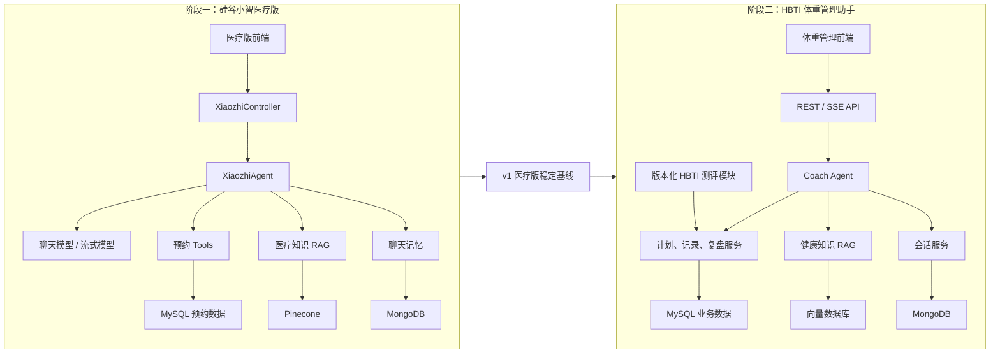
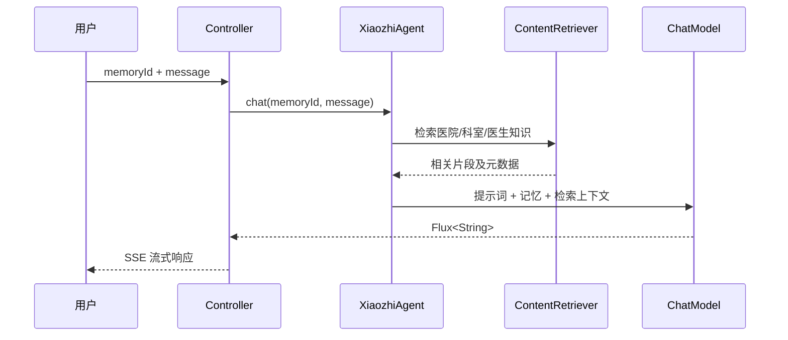
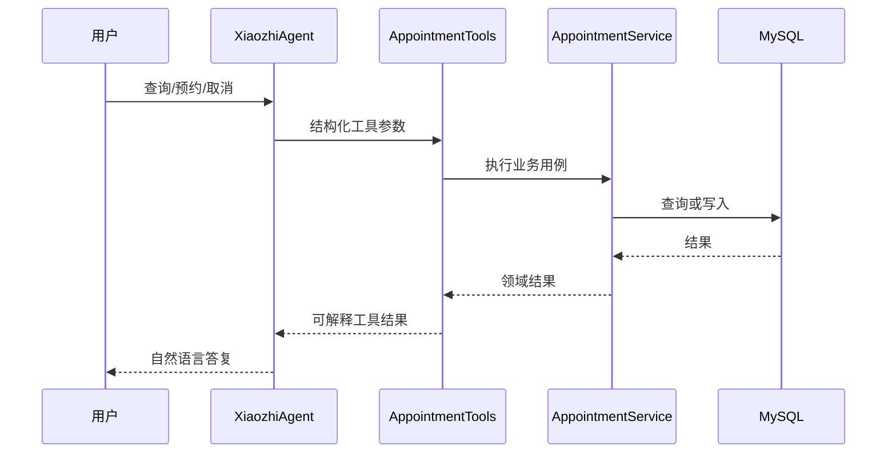

# 硅谷小智医疗版到 HBTI 体重管理助手：历史演进方案

> **文档状态：已被取代。** 当前实现以 `docs/architecture/hbti-coach-architecture.md`、产品规格和已接受 ADR 为准。本文仅保留早期课程迁移背景，不再作为任务或存储选型依据。

## 文档信息

- 状态：Accepted
- 日期：2026-08-14
- 当前项目：`java-ai-langchain4j`
- 关联项目：[`hbti-prototype`](https://github.com/WilliamClifton-dev/hbti-prototype)
- 决策主题：先完成可独立运行的硅谷小智医疗版，再演进为 HBTI 体重管理助手

> **执行路线更新（2026-08-14）：** ADR-001 已决定跳过医疗版，当前仓库直接进入 HBTI Coach。本文第 5 节及第一阶段医疗里程碑仅保留为历史方案；当前实现和后续任务以第二阶段、生产 SLO 及 ADR-001 为准。

## 1. 背景与决策

当前 Java 项目仍处于 LangChain4j、聊天记忆和模型接入阶段。硅谷小智医疗版的完整课程目标还包括医疗提示词、预约工具调用、MySQL、RAG、Pinecone、流式输出和前端联调。

HBTI 已经是一个独立的体重管理测评研究原型，包含四维倾向、问卷评分、结果表达和验证研究文档，但尚未完成心理测量学或临床验证。

本项目采用以下演进策略：

1. 第一阶段完整实现并验收硅谷小智医疗版，不提前替换业务主题。
2. 第一阶段完成后建立稳定基线并打版本标签。
3. 第二阶段保留已经验证过的 AI 基础设施，逐步替换领域能力，融合 HBTI 和体重管理闭环。
4. HBTI 继续作为独立研究原型维护；Java 系统通过版本化测评定义或稳定接口消费它，不把两个仓库直接混成一份代码。
5. 体重管理系统采用模块化单体。除非出现独立扩缩容或团队边界，不拆微服务。

### 1.1 为什么不立即魔改

- 课程项目提供了一条已经设计好的完整学习路径，可以先验证 LangChain4j 的主要能力。
- 在基础功能尚未闭环时替换业务，会同时引入 AI、体重管理、量表研究和产品设计四类不确定性。
- 保留完整医疗版基线，后续能够清楚展示“从课程实现到独立产品架构”的演进过程。
- 工具调用、RAG、记忆和流式输出可以先在较简单的预约场景中调通，再迁移到更复杂的体重管理场景。

### 1.2 不采用的方案

#### 方案 A：现在直接把医疗版改成体重管理助手

- 优点：较快看到目标产品界面。
- 缺点：课程主线中断，基础能力与业务错误混在一起，难以定位问题。
- 结论：拒绝。

#### 方案 B：医疗版和体重管理版同时开发

- 优点：表面上并行推进。
- 缺点：个人开发阶段上下文切换成本高，公共基础设施尚未稳定，容易重复实现。
- 结论：拒绝。

#### 方案 C：一开始拆成多个微服务

- 优点：模块边界在部署层面很明显。
- 缺点：增加服务发现、链路追踪、部署、数据一致性和本地调试成本，但当前没有对应规模收益。
- 结论：拒绝；先使用模块化单体。

## 2. 总体目标

### 2.1 第一阶段目标

形成一个可以独立运行和演示的医疗伴诊助手，完成以下技术闭环：

- 模型接入与配置隔离
- 多用户、多会话聊天记忆
- MongoDB 记忆持久化
- 医疗伴诊角色提示词
- MySQL 预约查询、创建和取消
- LangChain4j Function Calling
- 医院、科室和医生知识库 RAG
- Pinecone 向量检索
- Reactor 流式输出
- 前后端联调

### 2.2 第二阶段目标

形成一个面向普通成年体重管理用户的 AI 助手，完成以下业务闭环：

```text
安全筛查 -> 基础画像与 HBTI 测评 -> 生成计划 -> 每日记录
         -> 周期复盘 -> 调整计划 -> 持续反馈
```

### 2.3 非目标

- 不提供疾病诊断、处方或治疗决策。
- 不把 HBTI 类型描述成已经验证的生物学代谢亚型。
- 第一阶段不实现体重管理功能。
- 第二阶段 MVP 不实现食物图片识别、可穿戴设备同步、社交社区、支付或微服务化。
- 不让大模型直接决定热量、营养素和安全阈值。

## 3. 架构原则

1. **先建立基线，再演进。** 第一阶段必须能够独立构建、测试、运行和演示。
2. **领域逻辑与 AI 编排分离。** 数据计算、状态变更和安全规则使用确定性代码；大模型负责意图理解、解释和自然语言生成。
3. **模型可替换。** Agent 依赖 LangChain4j 抽象，不让业务服务依赖具体模型供应商。
4. **数据按职责存储。** MySQL 保存结构化业务数据，MongoDB 保存聊天记录，向量数据库保存知识片段及元数据。
5. **所有输出可追溯。** 保存计划版本、测评版本、知识来源和调整原因。
6. **研究与产品边界明确。** 产品使用数据不自动成为研究数据；研究必须单独知情同意。
7. **安全规则优先于个性化。** 风险筛查结果可以阻断或降级 AI 建议。

## 4. 分阶段总体架构



## 5. 第一阶段：硅谷小智医疗版

### 5.1 逻辑分层

| 层 | 职责 | 典型组件 |
|---|---|---|
| API 层 | 参数校验、SSE 响应、错误映射 | `XiaozhiController` |
| Agent 层 | 提示词、模型、记忆、Tools 和 RAG 编排 | `XiaozhiAgent` |
| 工具层 | 将模型意图映射到确定性业务方法 | `AppointmentTools` |
| 应用层 | 预约用例和事务边界 | `AppointmentService` |
| 持久化层 | 业务数据、聊天记录和向量数据访问 | Mapper、`MongoChatMemoryStore`、Embedding Store |
| 基础设施层 | 模型客户端、数据库和向量库配置 | Spring Configuration |

### 5.2 目标包结构

```text
com.atguigu.java.ai.langchain4j
├─ agent/                 # XiaozhiAgent
├─ controller/            # REST/SSE 入口
├─ tool/                  # AppointmentTools
├─ appointment/
│  ├─ entity/
│  ├─ mapper/
│  ├─ service/
│  └─ dto/
├─ memory/                # 聊天记忆与 MongoDB 存储
├─ rag/                   # 文档摄取、Embedding、检索器
├─ config/                # 模型和外部基础设施配置
└─ common/                # 统一错误和响应模型
```

课程代码可以逐步迁移到该结构，不要求为了目录整洁一次性重构。功能闭环优先于包结构调整。

### 5.3 核心请求流

#### 普通知识问答



#### 预约工具调用



### 5.4 数据职责

| 存储 | 数据 | 约束 |
|---|---|---|
| MySQL | 预约记录 | 结构化字段、唯一性与事务约束 |
| MongoDB | 按 `memoryId` 隔离的消息列表 | 不混用不同用户的会话 |
| Pinecone | 医院、科室、医生知识片段 | 保存来源、文档版本和片段标识 |

### 5.5 第一阶段里程碑

| 里程碑 | 交付内容 | 验收证据 |
|---|---|---|
| M1 模型与记忆 | 模型配置、多会话隔离、MongoDB 持久化 | 自动测试覆盖空会话、更新、删除和隔离 |
| M2 医疗 Agent | 系统提示词、Controller、统一请求对象 | API 可连续完成多轮问答 |
| M3 预约业务 | MySQL、Mapper、Service、Tools | 查询、创建、重复预约和取消均有测试 |
| M4 RAG | 文档加载、切分、Embedding、Pinecone 检索 | 固定问题能返回相关来源，低相关问题可拒答 |
| M5 流式前端 | `Flux<String>`、SSE、前端联调 | 首段响应可见，断开连接后能停止消费 |
| M6 工程化 | 配置隔离、日志、README、部署说明 | 新环境可按文档启动，不提交密钥 |

### 5.6 第一阶段完成门槛

只有同时满足以下条件，才进入 HBTI 融合阶段：

- `mvn test` 通过，测试不能只打印模型回答。
- MongoDB 空记录和已有记录读取逻辑正确，无空指针。
- 预约的查询、创建、重复校验和取消形成闭环。
- RAG 返回知识来源，并对知识库外问题实施降级或拒答。
- 流式接口和前端可以实际运行。
- 所有密钥通过环境变量或本地未跟踪配置注入。
- README 包含依赖、启动步骤、数据库初始化和演示路径。
- 建立 `xiaozhi-medical-v1` Git 标签，保留可演示基线。

课程内容完成不等于简历就绪。上述门槛中的自动测试、来源追溯、配置安全和运行文档属于简历级补强。

## 6. 第二阶段：HBTI 体重管理助手

### 6.1 产品定位

面向希望改善体重、饮食、运动和生活方式的普通成年人。系统提供非诊断性的自我管理支持，不面向急性疾病、妊娠、未成年人或需要临床治疗决策的人群。

HBTI 的作用是描述自我报告的行为和调节倾向，用于调整计划表达、提醒策略和执行支持；基础热量、训练负荷和风险边界由可解释的规则计算。

### 6.2 领域模块

| 模块 | 职责 | 是否允许 LLM 直接写入 |
|---|---|---|
| Identity | 用户、认证、授权 | 否 |
| Profile | 身高、体重、活动水平和健康限制 | 否 |
| Assessment | HBTI 题目、评分、版本和结果 | 否 |
| Planning | 饮食与训练计划、计划版本 | 仅生成草案，需规则校验 |
| Tracking | 体重、饮食、步数、训练、睡眠记录 | 否，必须调用 Tool |
| Review | 周趋势、完成率和调整原因 | 统计由代码完成，LLM 负责解释 |
| Knowledge | 权威资料摄取、检索和引用 | 只读 |
| Conversation | 多轮会话与记忆 | 可追加消息，不直接改业务表 |
| Safety | 风险筛查、建议边界和转介提示 | 否，优先级最高 |

### 6.3 第二阶段模块化单体

```text
com.example.hbticoach
├─ identity/
├─ profile/
├─ assessment/
├─ planning/
├─ tracking/
├─ review/
├─ knowledge/
├─ conversation/
├─ safety/
├─ agent/
└─ infrastructure/
```

模块之间通过应用服务和明确 DTO 交互，不直接跨模块访问 Mapper。未来只有在出现独立部署需求时，才将模块提取为服务。

### 6.4 HBTI 集成边界

HBTI 原型仓库继续承担：

- 测评理论、候选题项与研究文档
- 静态体验和分享卡
- JavaScript 参考评分实现
- 认知访谈、专家评审和量表验证材料

Java 体重管理系统承担：

- 已发布测评版本的服务端评分
- 用户作答、授权和数据治理
- 结果与计划、记录、复盘之间的业务关联
- AI 编排与正式 API

测评定义建议抽为版本化 JSON，至少包含：

```json
{
  "assessmentId": "hbti",
  "version": "1.0.0",
  "dimensions": ["FS", "HC", "RW", "ND"],
  "items": [],
  "scoringRuleVersion": "1.0.0"
}
```

JavaScript 与 Java 实现必须共享一组黄金测试样例，确保相同答案得到相同连续维度分数和类型代码。历史结果必须保存测评版本，题目更新不能改变旧结果的解释依据。

### 6.5 核心数据模型

| 聚合/表 | 关键字段 |
|---|---|
| `user_account` | `id`, `email`, `status`, timestamps |
| `health_profile` | `user_id`, age range, sex, height, activity level, constraints |
| `assessment_session` | `id`, `user_id`, `assessment_version`, status |
| `assessment_answer` | `session_id`, `item_id`, `value` |
| `assessment_result` | 四个连续分数、类型代码、评分版本 |
| `weight_goal` | 起始值、目标范围、目标日期、状态 |
| `plan` | `user_id`, `version`, 周期、状态、生成依据 |
| `plan_item` | 类型、日期、目标值、可替换规则 |
| `daily_log` | 日期、体重、饮食完成度、步数、训练、睡眠 |
| `metric_record` | 指标类型、数值、单位、来源、记录时间 |
| `weekly_review` | 趋势、完成率、调整规则、解释文本 |
| `knowledge_source` | 标题、发布机构、版本、URL、更新时间 |

敏感健康信息与公开分享内容必须分离。分享卡只能使用用户明确选择公开的字段。

### 6.6 AI 与确定性逻辑的边界

#### 必须由代码完成

- BMI、BMR、TDEE 和单位换算
- 热量与训练安全上下限
- 体重趋势和移动平均
- 完成率、连续打卡和周统计
- HBTI 评分
- 计划版本和状态流转
- 风险筛查与权限校验

#### 可以由大模型完成

- 理解用户自然语言意图
- 在规则限定范围内生成候选菜单和训练表达
- 基于统计结果解释周报
- 将 HBTI 倾向转化为提醒方式和行为建议
- 基于 RAG 回答知识问题并组织引用

任何会改变结构化业务数据的 Agent 行为都必须通过 Tool 调用应用服务，不能让模型直接执行 SQL 或生成最终计算值。

### 6.7 推荐 API 边界

| 方法 | 路径 | 用途 |
|---|---|---|
| `POST` | `/api/v1/assessments/hbti/sessions` | 开始测评 |
| `PUT` | `/api/v1/assessments/hbti/sessions/{id}/answers` | 保存答案 |
| `POST` | `/api/v1/assessments/hbti/sessions/{id}/complete` | 完成评分 |
| `GET` | `/api/v1/assessments/hbti/results/latest` | 获取最新结果 |
| `POST` | `/api/v1/goals` | 创建体重管理目标 |
| `POST` | `/api/v1/plans` | 生成经过规则校验的计划 |
| `POST` | `/api/v1/logs/daily` | 提交每日记录 |
| `GET` | `/api/v1/reviews/weekly/latest` | 获取最近周报 |
| `GET` | `/api/v1/chat/stream` | SSE 对话流 |

正式实现 API 前应补充请求、响应、错误码、幂等规则和 OpenAPI 契约。

## 7. RAG 与知识治理

### 7.1 知识来源

优先使用能够追踪版本和发布时间的权威来源，例如国家卫生机构、专业学会指南和经过同行评议的综述。社交媒体内容不能直接进入核心知识库。

### 7.2 摄取流程

```text
来源登记 -> 文档下载 -> 解析与清洗 -> 分段 -> 元数据标注
         -> Embedding -> 向量存储 -> 检索测试 -> 发布
```

每个片段至少保存：`sourceId`、标题、发布机构、原始 URL、版本或日期、章节和摄取时间。

### 7.3 回答要求

- 健康知识回答显示来源。
- 没有足够相关证据时明确表示无法确认。
- HBTI 个性化建议必须区分“测评倾向”“确定性计算”和“知识来源”。
- 建立固定问答集，评估相关性、引用正确性、拒答和安全性。

## 8. 安全、隐私与研究边界

### 8.1 产品安全

- 首次生成计划前完成风险筛查。
- 对未成年人、妊娠、进食障碍风险和重大疾病用户停止自动个性化，提示寻求专业人员帮助。
- 不生成极端热量缺口、惩罚性运动或药物建议。
- 用户可以删除账号、测评答案、健康记录和会话数据。

### 8.2 数据安全

- 密钥只通过环境变量或密钥管理服务注入。
- 身份数据与健康数据采用最小权限访问。
- 日志不得输出完整提示词中的敏感健康信息。
- 所有业务查询必须校验资源归属，`memoryId` 不能代替用户认证。
- 研究导出数据必须去标识化。

### 8.3 研究边界

- HBTI 当前是探索性工具，不声称临床有效。
- 用户同意服务条款不等于同意参加研究。
- 用于论文的数据采集需要单独知情同意、退出机制、数据用途说明和适当伦理审查。
- 产品端类型标签用于沟通；论文分析优先使用连续维度分数。
- 第一篇研究应验证量表结构、信度和构念效度，不同时声称 AI 干预有效。

## 9. 测试策略

| 测试层级 | 第一阶段 | 第二阶段 |
|---|---|---|
| 单元测试 | 记忆存储、预约服务、Tool 参数 | 计算器、HBTI 评分、计划规则、趋势统计 |
| 集成测试 | MongoDB、MySQL、向量检索 | 模块边界、数据归属、计划版本 |
| 契约测试 | Controller 和 SSE 格式 | REST/OpenAPI、Agent Tool schema |
| AI 评测 | 医院问答、工具选择、拒答 | 引用、安全边界、个性化解释 |
| 端到端测试 | 聊天、预约、取消、RAG | 测评、计划、打卡、周报、调整 |

外部模型测试与普通单元测试分组运行，避免网络、额度和模型随机性导致默认构建不稳定。

## 10. 可观测性

至少记录以下结构化指标，但不得记录敏感正文：

- 请求数量、错误率和延迟
- 模型名称、调用耗时、Token 用量和失败类型
- Tool 名称、执行结果和耗时
- RAG 检索耗时、最高相关度和引用数量
- SSE 首 Token 时间和中断数量
- 计划生成、打卡和周报成功率
- 安全规则拦截类别

关键流程使用关联 ID 串联 Controller、Agent、Tool 和数据库操作。

## 11. 非功能需求与生产 SLO

本节中的数字是公开测试版的首版容量假设和验收基线，不代表当前系统已经达到这些指标。每次正式发布前必须通过压测、故障演练和 AI 评测验证；上线后每月根据真实流量重新校准。

### 11.1 服务等级划分

| 等级 | 用途 | 承诺 |
|---|---|---|
| L0 本地演示 | 课程学习、面试演示 | 无对外 SLO，要求可重复启动和完整演示 |
| L1 公开测试版 | 小规模真实用户试用 | 发布内部 SLO，但不承诺企业 SLA |
| L2 生产版 | 稳定公开服务 | 持续测量 SLO、错误预算、备份恢复和安全响应 |
| L3 企业服务 | 付费组织或机构使用 | 在 L2 实测基础上提供合同 SLA、值班和合规治理 |

当前代码处于 L0。第二阶段 MVP 的目标是达到 L1；只有连续运行、容量验证和运维机制均有证据后，才能宣称达到 L2 或 L3。

### 11.2 容量与规模假设

公开测试版按以下规模设计：

| 指标 | 初始目标 |
|---|---:|
| 注册用户 | 10,000 |
| 日活用户 | 1,000 |
| 普通业务 API 峰值 | 50 QPS |
| 同时在线 SSE 会话 | 100 |
| 同时执行的模型请求 | 20，超过后进入有界队列 |
| 单用户同时进行的会话请求 | 同一个 `conversationId` 最多 1 个 |
| 单次用户消息 | 最大 4,000 字符 |
| 单次 RAG 文档上传 | 默认最大 20 MB，仅允许白名单格式 |

容量验收采用接近生产的环境和匿名化测试数据：

- 以目标峰值的 1.5 倍持续压测 30 分钟；
- 业务 API 错误率低于 1%；
- 队列必须有长度和等待时间上限，禁止无界堆积；
- 达到模型并发上限时返回可识别的限流或稍后重试响应，不拖垮业务 API；
- 压测报告保存测试版本、数据量、机器规格、模型供应商和测试时间。

如果真实流量连续 7 天超过设计容量的 70%，应启动扩容评审，而不是等到服务饱和。

### 11.3 可用性与错误预算

以自然月为统计窗口：

| 服务能力 | L1 内部 SLO | L2 目标 SLO |
|---|---:|---:|
| 登录、画像、测评、计划、记录等核心业务 API | 99.5% | 99.9% |
| AI 对话完整能力 | 99.0% | 99.5% |
| 降级后的只读查询与确定性计算 | 99.5% | 99.9% |

可用性只计算服务端可控制的成功请求，并明确排除计划维护窗口和客户端主动断开。不能通过删除失败请求或扩大排除项美化指标。

- 99.9% 月度错误预算约为 43 分 50 秒；
- 99.5% 月度错误预算约为 3 小时 39 分；
- 错误预算消耗达到 50% 时暂停非必要高风险发布；
- 错误预算耗尽时优先修复可靠性问题，不继续增加新功能。

公开测试版若没有值班能力，应明确标注为测试服务，不能对外承诺企业 SLA。

### 11.4 延迟目标

延迟从服务端接收请求开始计算，并分别统计模型和非模型路径：

| 指标 | p50 | p95 | p99 |
|---|---:|---:|---:|
| 非 AI 读取 API | 100 ms | 300 ms | 800 ms |
| 非 AI 写入 API | 150 ms | 500 ms | 1 s |
| RAG 检索，不含模型生成 | 250 ms | 800 ms | 1.5 s |
| SSE 首 Token 时间 | 1.2 s | 3 s | 6 s |
| 常规完整回答 | 8 s | 20 s | 40 s |
| 单个本地 Tool 执行 | 100 ms | 500 ms | 1 s |

模型供应商、模型名称、输入 Token 档位和是否触发 Tool 必须作为延迟指标标签，但标签中不得包含用户正文或健康数据。

### 11.5 调用限额与成本上限

限额必须可配置，不写死在 Prompt 中。公开测试版初始限制：

| 限制 | 默认值 |
|---|---:|
| 单用户 AI 请求 | 20 次/10 分钟，100 次/天 |
| 单次模型输入 | 最大 8,000 Token |
| 单次模型输出 | 最大 1,500 Token |
| 单次 RAG 注入 | 最多 5 个片段、合计不超过 3,000 Token |
| 单次连续 Tool 调用 | 最多 4 次 |
| 同一会话并发调用 | 1 |

成本按用户、场景、模型和日期聚合：

- 设置全局月度预算、单用户日预算和单请求预算；
- 预算达到 70% 时告警，达到 90% 时关闭高成本非核心能力；
- 达到 100% 时切换低成本模型或降级为确定性功能和静态说明；
- 记录 Prompt、RAG、历史消息、输出分别消耗的 Token；
- 本地 Ollama 也记录 Token、GPU/CPU 时间和队列等待，不能把本地推理视为零成本。

具体金额根据模型供应商价格配置，不在代码或架构文档中固定。

### 11.6 超时、重试、熔断与降级

| 依赖 | 超时基线 | 重试 | 降级策略 |
|---|---:|---|---|
| 聊天模型首响应 | 10 s | 仅在未产生输出时重试 1 次 | 切换备用模型或返回稍后重试 |
| 聊天模型总调用 | 45 s | 不重复已执行的 Tool 写操作 | 保留确定性功能和只读数据 |
| Embedding/RAG | 3 s | 幂等查询重试 1 次 | 无 RAG 时明确说明无法提供有来源的回答 |
| MySQL/MongoDB | 2 s | 只对明确幂等读操作重试 | 写入失败不声称成功，返回可重试错误 |
| 外部内容下载 | 10 s | 重试 1 次 | 标记摄取失败，不发布不完整知识版本 |

熔断器以最近至少 20 次调用为统计窗口；失败率达到 50% 时打开 30 秒，再进行少量探测。阈值最终由压测和生产指标校准。

降级顺序：

1. 关闭非必要的生成式说明和内容润色；
2. 主模型切换到已评测的备用模型；
3. RAG 不可用时停止生成需要知识证据的回答；
4. 模型整体不可用时保留登录、记录、趋势计算、计划查看和数据导出；
5. 数据库写入不可用时系统进入只读或明确失败状态，禁止假成功。

所有写操作使用幂等键或业务唯一约束，模型超时和客户端重试不能造成重复记录、重复计划或重复预约。

### 11.7 数据保留与删除

| 数据类型 | 默认保留期限 | 删除规则 |
|---|---|---|
| 模型 ChatMemory | 最近消息窗口或最长 30 天 | 会话结束、过期或用户主动清除 |
| 用户可见聊天历史 | 180 天 | 用户可主动删除，产品可允许自定义期限 |
| 体重、计划和每日记录 | 账号存续期 | 注销后 7 天内从在线库删除 |
| 安全与访问审计日志 | 180 天 | 到期自动清理，日志不保存敏感正文 |
| 普通应用日志 | 30 天 | 到期自动清理 |
| 未完成的测评会话 | 30 天 | 到期自动清理 |
| 独立研究数据 | 以知情同意和伦理方案为准 | 与产品账号删除流程分别说明 |

删除请求必须生成可审计任务：在线数据在 7 天内删除，备份副本随备份生命周期在 30 天内自然过期。法律或安全事件要求保留的数据必须说明依据和范围。

### 11.8 备份、恢复与灾难恢复

公开测试版目标：

| 数据 | RPO | RTO | 策略 |
|---|---:|---:|---|
| MySQL 业务数据 | 1 小时 | 4 小时 | 每日全量备份 + 增量或日志备份 |
| MongoDB 会话数据 | 4 小时 | 8 小时 | 定时快照，聊天历史与记忆分离 |
| 向量数据库 | 24 小时 | 8 小时 | 保存原始文档、分片和版本，可重新构建 |
| Prompt、规则和应用配置 | 每次提交 | 1 小时 | Git 版本和发布制品 |

- 备份必须加密，并与生产账号或主机隔离；
- 至少每季度执行一次恢复演练，不能只检查“备份任务成功”；
- 恢复演练验证数据完整性、应用可启动性和版本兼容性；
- L2 生产目标进一步收紧为核心业务 RPO 5 分钟、RTO 1 小时，达标前不宣称该能力。

### 11.9 Prompt、知识库、模型和测评版本治理

每次 AI 回答、计划生成和测评结果至少关联：

```text
applicationVersion
modelProvider + modelName + modelConfigVersion
corePromptVersion + scenePromptVersion + promptContentHash
knowledgeBaseVersion + retrievedSourceIds
toolSchemaVersion
assessmentVersion + scoringRuleVersion
```

版本规则：

- Prompt 使用语义版本或日期版本，内容变更必须更新哈希；
- 知识库采用不可变发布版本，新摄取内容先进入候选库，评测后再发布；
- 测评题目或评分规则变化必须产生新版本，历史结果按原版本解释；
- 模型或温度、最大 Token、Tool Schema 变化视为可评测的行为变更；
- 所有版本支持快速回滚到最近一个通过评测的组合；
- 生产日志保存版本 ID，不保存完整敏感 Prompt 上下文。

### 11.10 RAG 与 Agent 上线评测门槛

建立版本化固定评测集，至少覆盖普通问答、知识库外问题、Tool 调用、安全风险、提示注入、数据越权和边界输入。

公开测试版最低门槛：

| 指标 | 发布门槛 |
|---|---:|
| Tool 选择准确率 | >= 95% |
| Tool 参数结构有效率 | >= 98% |
| 写操作未经确认执行 | 0 个高危案例 |
| RAG 检索命中率，固定问答集 | >= 90% |
| 引用支持回答结论的比例 | >= 95% |
| 知识库外问题正确拒答率 | >= 90% |
| 跨用户数据泄露 | 0 |
| 高危健康建议 | 0 |
| 高危提示注入成功 | 0 |

每个候选发布版本必须：

1. 跑完整固定评测集；
2. 与当前生产基线对比，核心指标下降超过 2 个百分点则阻止发布；
3. 对安全案例进行人工复核；
4. 保存模型、Prompt、知识库和 Tool 版本；
5. 上线后进行小流量观察，指标异常时自动或人工回滚。

评测门槛不能证明模型绝对安全，但可以防止未经验证的 Prompt、模型或知识库变更直接上线。

### 11.11 安全事件与模型故障手册

在 `docs/runbooks/` 中维护至少以下手册：

- `model-provider-outage.md`：模型超时、限流、不可用和备用模型切换；
- `database-degradation.md`：连接池耗尽、慢查询、主库故障和只读降级；
- `rag-quality-regression.md`：错误引用、知识污染和知识版本回滚；
- `prompt-injection-or-data-leak.md`：提示注入、跨用户泄露、密钥或健康数据暴露；
- `cost-spike.md`：Token 异常、循环 Tool 调用和恶意消耗；
- `backup-restore.md`：备份校验、恢复步骤和恢复后验证。

事件级别和响应目标：

| 级别 | 示例 | 首次响应目标 |
|---|---|---:|
| SEV-1 | 数据泄露、跨用户访问、大面积不可用 | 15 分钟 |
| SEV-2 | 核心功能明显降级、错误率持续超标 | 30 分钟 |
| SEV-3 | 局部故障、有替代路径 | 1 个工作日 |

SEV-1 优先停止泄露或破坏面，必要时关闭相关功能，而不是先尝试维持完整体验。事件结束后 5 个工作日内完成无责复盘，记录时间线、影响、根因、修复和防复发措施。

个人维护阶段如果无法提供 24/7 响应，应在服务说明中明确支持时段；不能把文档中的响应目标当成已经具备的值班能力。

### 11.12 SLO 验证与晋级条件

达到目标的证据必须包括：

- 连续 30 天可用性、延迟、错误率和成本报表；
- 与目标容量一致的压测报告；
- 至少一次模型故障降级演练；
- 至少一次数据库或备份恢复演练；
- 发布版本的完整 AI 评测报告；
- 安全扫描、权限测试和提示注入测试结果；
- 事故告警能够实际触达维护者。

只有指标连续达标并完成演练，才能从 L1 晋级 L2。L3 还需要合同 SLA、多人值班、权限治理、审计与适用的合规评估，不能仅通过增加服务器数量获得。

## 12. 发布与内容复用

同一套成果按不同证据强度输出：

| 场景 | 重点 | 允许的表述 |
|---|---|---|
| 简历 | 架构、AI 编排、业务闭环、测试与部署 | 描述实际实现和测量结果 |
| GitHub | 可运行代码、架构文档、演示和限制 | 公开技术事实与已知缺口 |
| 社交媒体 | 类型科普、开发过程、功能演示 | 明确是自我观察和研究原型 |
| 学术文章 | 题项、样本、统计方法、信效度 | 只陈述数据支持的结论 |

社交媒体素材可以来自产品迭代，但不能把互动量当成科学验证结果。

## 13. 第二阶段里程碑

| 里程碑 | 交付内容 | 退出条件 |
|---|---|---|
| W1 领域骨架 | 用户、画像、认证、数据库迁移 | 可以创建并安全读取个人画像 |
| W2 HBTI 集成 | 版本化题目、服务端评分、黄金测试 | JS 与 Java 评分一致 |
| W3 计划引擎 | 确定性计算、计划规则、计划版本 | 边界值和风险输入测试通过 |
| W4 跟踪闭环 | 每日记录、趋势、周报 | 固定数据可复现统计结果 |
| W5 AI Coach | Tools、RAG、SSE、个性化解释 | 业务写入只能通过 Tool |
| W6 上线准备 | 隐私、删除、监控、部署、备份 | 端到端与安全测试通过 |
| W7 研究准备 | 独立同意、数据字典、导出和审计 | 研究流程与产品流程明确分离 |

## 14. 风险与应对

| 风险 | 影响 | 应对 |
|---|---|---|
| 课程代码与目标产品耦合 | 后续难以替换领域 | 第一阶段建立清晰 Agent、Tool、Service 边界 |
| LLM 生成错误计算 | 不安全且不可复现 | 计算和阈值全部由确定性服务完成 |
| HBTI 被理解为诊断 | 科学与伦理风险 | 持续显示限制，使用连续分数，避免生物学定论 |
| RAG 有引用但引用不支持结论 | 形成虚假可信度 | 做引用一致性评测，不只检查是否有链接 |
| 健康数据泄露 | 用户伤害和合规风险 | 最小采集、归属校验、脱敏日志、可删除 |
| 功能范围过大 | 无法形成可演示闭环 | 按里程碑推进，MVP 明确排除项 |
| 为论文直接复用产品数据 | 研究不合规 | 独立知情同意和伦理流程 |

## 15. Definition of Done

### 第一阶段完成

- 医疗助手的聊天、记忆、预约、RAG、流式输出和前端全部可演示。
- 核心业务有自动化测试，外部模型测试可单独运行。
- 本地环境可以按照 README 从零启动。
- 配置中没有明文密钥。
- 已建立稳定版本标签。

### 第二阶段 MVP 完成

- 用户能够完成安全筛查和 HBTI 测评。
- 系统能够生成经过规则校验的计划。
- 用户能够连续提交每日记录并获得可复现的周报。
- AI 能解释结果、调用工具和引用知识来源，但不能绕过业务规则。
- 用户能够查看和删除自己的数据。
- 产品文案、研究文档和社交媒体均不宣称 HBTI 已获医学验证。
- 目标容量的 1.5 倍压测持续 30 分钟且错误率低于 1%。
- 核心业务 API、AI 对话、延迟和成本指标均能被采集并形成报表。
- Prompt、模型、知识库、Tool 和 HBTI 评分版本可以追溯和回滚。
- 固定 AI 评测集达到第 11.10 节的发布门槛。
- 模型不可用时，记录、趋势计算、计划查看和数据导出仍然可用。
- 完成一次备份恢复演练和一次模型故障降级演练。
- 数据保留、用户删除和研究知情同意流程均通过验收。

## 16. 下一步

当前直接执行 HBTI 阶段。已先建立 `HTTP API -> 场景 Prompt -> HbtiCoachAgent -> MongoDB ChatMemory` 纵向切片；下一步按 HBTI 服务端评分、用户画像与安全筛查、确定性计划引擎、每日记录与周报、RAG、流式输出的顺序逐项实现和验收。医疗阶段不再作为前置门槛。
